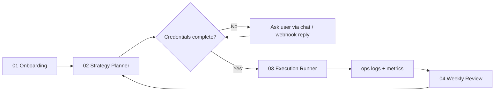

# Architecture

## Two-layer model

```
┌─────────────────────────────────────────────────────────────┐
│  Strategy layer — Cursor Automations (Cloud / cron)         │
│  Read intake + ops logs → update strategy + registry        │
│  Commit to GitHub                                           │
└────────────────────────────┬────────────────────────────────┘
                             │ git pull / push
                             ▼
┌─────────────────────────────────────────────────────────────┐
│  Execution layer — Cloud Agent / EC2 / Local worker         │
│  npm run marketing:execute -- <taskId>                      │
│  Playwright, Telegram client, email, webhooks               │
└─────────────────────────────────────────────────────────────┘
```

**Rule:** Cursor Automation does not replace authenticated browser sessions on desktop. Social login flows run on a worker with saved sessions.

## Data flow

| File | Writer | Reader |
|------|--------|--------|
| `intake/active.json` | Onboarding automation / user | Strategy planner, validate script |
| `strategy/active-plan.md` | Strategy planner | Execution runner, weekly review |
| `runtime/orchestrator/registry.json` | Strategy + execution agents | `marketing:execute` |
| `runtime/orchestrator/plan.json` | Strategy review | Orchestrator priorities |
| `ops/state/metrics.json` | Execution tasks | Weekly review |
| `ops/daily/*.md` | Execution automations | Weekly review |
| `.env.local` | User (local only) | Local scripts — **never committed** |

## Automation sequence



## Runtime placement guide

| Task type | Recommended runtime |
|-----------|---------------------|
| Content generation, git commits | Cursor Cloud |
| Scheduled browser (no login) | Cursor Cloud |
| FB/IG with saved session | Local Windows + Playwright |
| Telegram DM / reply watcher | EC2 or VPS (PM2) |
| Webhook receivers | EC2 + HTTPS |
| Stripe test checkout | Cloud with Secrets |

## Git as source of truth

Cloud agents only run code that exists on GitHub. Workflow:

1. Agent edits files locally in automation run
2. `git commit && git push` (enable in automation settings)
3. EC2/local worker `git pull` before each run (or use `GIT_AUTO_SYNC=1`)
