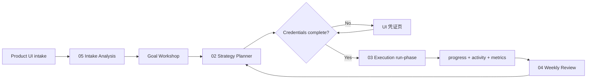

# Architecture

> 产品定义：[product/PRD.md](./product/PRD.md) · 多租户：[product/multi-tenant-model.md](./product/multi-tenant-model.md)  
> **实现技术文档：[product/implementation.md](./product/implementation.md)** — API、模块、数据、分阶段交付

## Three-layer model

```
┌─────────────────────────────────────────────────────────────┐
│  Product layer — Web UI + Platform API                       │
│  用户 / 项目 CRUD · UI 表单 · 凭证 Vault · 仪表盘            │
│  每个 projectId 独立工作区                                    │
└────────────────────────────┬────────────────────────────────┘
                             │ projectId-scoped read/write
                             ▼
┌─────────────────────────────────────────────────────────────┐
│  Strategy layer — Cursor Automations (Cloud / cron)         │
│  读 **本项目** intake + ops → 更新 strategy + registry        │
└────────────────────────────┬────────────────────────────────┘
                             │
                             ▼
┌─────────────────────────────────────────────────────────────┐
│  Execution layer — Cloud / EC2 / Local worker               │
│  仅执行 **本项目** campaigns + registry tasks                 │
└─────────────────────────────────────────────────────────────┘
```

**客户不接触 Git clone。** 平台为每个项目 provisioning 独立目录（或独立 Git 子仓库）。

**Rule:** Cursor Automation does not replace authenticated browser sessions on desktop. Social login flows run on a worker scoped to that project.

## Per-project workspace

Each project is isolated under:

```
tenants/{userId}/projects/{projectId}/
├── intake/active.json
├── strategy/active-plan.md
├── runtime/orchestrator/
├── campaigns/
└── ops/
```

See [product/multi-tenant-model.md](./product/multi-tenant-model.md).

## Data flow (within one project)

| File | Writer | Reader |
|------|--------|--------|
| `intake/active.json` | Product UI / Onboarding automation | Strategy planner |
| `strategy/active-plan.md` | Strategy planner | UI preview, Execution |
| `runtime/orchestrator/registry.json` | Strategy agent | Execution runner |
| `ops/activity/events.jsonl` | UI / Automations | Timeline, support |
| `ops/state/metrics.json` | metrics campaigns | UI L2/L3, Weekly review |
| Vault refs | Product UI | Execution (via Secrets) |

## Automation sequence (per project)



Dual gate before Planner: `userConfirmedAnalysis` + `userConfirmedGoals`.  
Full API/worker spec: [product/implementation.md](./product/implementation.md).

## Runtime placement guide

| Task type | Recommended runtime |
|-----------|---------------------|
| Content generation | Cursor Cloud |
| Scheduled browser (no login) | Cursor Cloud |
| FB/IG with saved session | Local worker **per project** |
| Telegram reply watcher | EC2/VPS **per project or container** |
| Stripe test checkout | Cloud + project-scoped Secrets |

## Storage

| Approach | Notes |
|----------|--------|
| Object storage + DB metadata | SaaS default; UI reads via API |
| Git repo per project | Optional; Automation git push to project repo |
| Monorepo `tenants/...` | Platform repo private; strict path ACL |

Secrets never in git; use Vault with `MA_{projectId}_*` naming.
