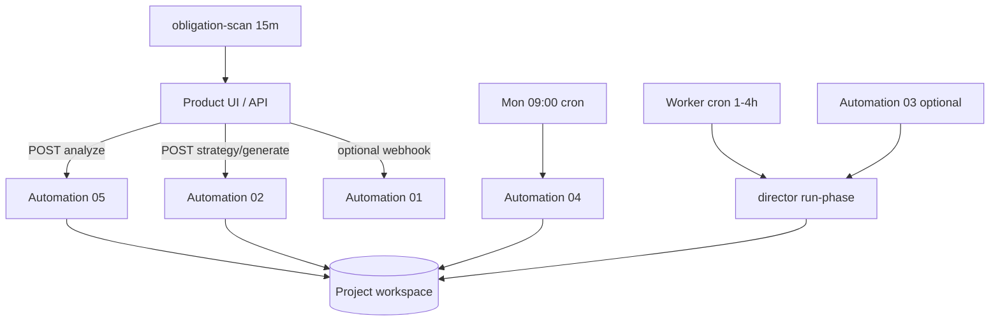

# Cursor Automations — 产品集成说明

定义 Marketing Autopilot **需要几个 Automation、各自职责、如何 trigger**，以及 **Platform Worker** 与 Cursor 的分工。  
实现细节：[implementation.md](./implementation.md) §9 · 指令：`automations/instructions/*.txt` · Prefill：`automations/prefill/*.json`

> 总指挥契约：[automation-commander.md](./automation-commander.md)  
> 计费 run 类型：[pricing.md](./pricing.md) §2.3

---

## 1. 需要几个 Automation？

**Cursor Automations：5 个**（仓库已含指令 + prefill）

| ID | 名称 | 必需 | 层级 |
|----|------|------|------|
| **01** | Intake Onboarding | 可选 | Strategy — 对话补全 Intake |
| **05** | Intake Analysis | **必需** | Strategy — 可行性 + 现有营销盘点 |
| **02** | Strategy Planner | **必需** | Strategy — plan + phases + campaigns |
| **03** | Execution Runner | Dogfood/过渡 | Execution — Agent 内跑 `run-phase` |
| **04** | Weekly Review | **必需** | Strategy — 周报与 plan 调整 |

**另：Platform Worker（不是 Cursor Automation）**

| Worker 任务 | 必需 | 说明 |
|-------------|------|------|
| `run-phases.mjs` | **必需（SaaS）** | 定时 `director.js run-phase`；**生产环境替代 03** |
| `obligation-scan.mjs` | **必需** | 合并 open obligations |
| `notification-send.mjs` | **必需** | 邮件/Push 催促 |
| `provision.mjs` | **必需** | 新建 Project 复制模板 |

---

## 2. 架构分工（v0.2 目标）



| 工作 | v0.2 推荐执行者 |
|------|-----------------|
| 站点被动扫描（无 LLM） | **Platform / `runtime/analysis/site-scan.mjs`**（05 前置） |
| 材料 LLM 分析、feasibility 正文 | **Cursor Automation 05** |
| 生成 phases、campaigns | **Cursor Automation 02** |
| 高频 phase 执行 | **Platform Worker** → `npm run marketing:phase` |
| 周复盘 | **Cursor Automation 04** |

---

## 3. 五个 Automation 详解

### 3.1 01 — Intake Onboarding（可选）

| 项 | 内容 |
|----|------|
| **指令** | `automations/instructions/01-intake-onboarding.txt` |
| **触发** | Cursor **Webhook**；UI「与 Agent 对话补全」→ Platform 转发 |
| **前置** | 已有 `projectId` |
| **产出** | 更新 `intake/active.json` 缺项 |
| **计费** | 不计入 execution；可计 Agent 用量 |

---

### 3.2 05 — Intake Analysis（必需）★

| 项 | 内容 |
|----|------|
| **指令** | `automations/instructions/05-intake-analysis.txt` |
| **触发** | `POST /api/projects/:id/intake/analyze` → Platform **Webhook → Cursor 05** |
| **前置** | Intake 最小必填（见 §4.1）；`materials` 可空但推荐有 URL/资料 |
| **Platform 前置** | `npm run marketing:analyze:prepare` → 被动扫站 + `existing-marketing.json` 骨架 + activity |
| **产出** | `feasibility.md`、`extracted.json`、`existing-marketing.json`、material-notes；`analysisCompletedAt`；**不** 设 `userConfirmedAnalysis` |
| **计费 run** | `analysis_run`（Free 每月 2 次） |

**双阶段（实现）：**

1. **Prepare（Node，无 Cursor）** — `runtime/analysis/prepare-analysis.mjs`  
2. **Agent（Cursor 05）** — LLM 分析材料 + 写 feasibility 全文

---

### 3.3 02 — Strategy Planner（必需）

| 项 | 内容 |
|----|------|
| **指令** | `automations/instructions/02-strategy-planner.txt` |
| **触发** | `POST /api/projects/:id/strategy/generate` → Webhook → Cursor 02 |
| **前置** | `userConfirmedAnalysis === true` **且** `userConfirmedGoals === true` |
| **产出** | `active-plan.md`、`phases.json`、`registry.json`、`campaigns/`、`progress.json` |
| **计费 run** | `planner_run` |

---

### 3.4 03 — Execution Runner（Dogfood / 可选）

| 项 | 内容 |
|----|------|
| **指令** | `automations/instructions/03-execution-runner.txt` |
| **触发（prefill）** | Cursor Cron `0 */4 * * *` |
| **SaaS** | **改用** Platform Worker `run-phases.mjs`（不每次开 Agent） |
| **行为** | `npm run marketing:phase` → `director run-phase` |
| **计费 run** | `phase_run` / `task_run` |

---

### 3.5 04 — Weekly Review（必需）

| 项 | 内容 |
|----|------|
| **指令** | `automations/instructions/04-weekly-review.txt` |
| **触发** | Cron `0 9 * * 1`（周一 09:00 UTC，可 per-project 调度） |
| **输入** | `ops/weekly/`、`metrics.json`、Goal Workshop KPI 缺口 |
| **产出** | 周报；可能调整 `phases.json` / plan |
| **计费 run** | `review_run` |

---

## 4. Trigger 参考

### 4.1 Intake Analysis 最小必填（05 前置校验）

| 字段 | 路径 |
|------|------|
| 产品名 | `product.name` |
| 产品 URL | `product.url`（http/https） |
| 主受众 | `audience.primary` |
| ≥1 目标区域 | `audience.geographyRegions[]` |
| 是否已有营销 | `existingMarketing.hasActiveMarketing` !== null |

实现：`runtime/analysis/validate-intake.mjs`

### 4.2 Webhook Payload（Platform → Cursor）

所有 Strategy Layer Automation **必须**收到：

```json
{
  "userId": "usr_xxx",
  "projectId": "prj_yyy",
  "workspaceRoot": "/data/tenants/usr_xxx/projects/prj_yyy",
  "automationName": "05-intake-analysis",
  "correlationId": "run_01HABC",
  "env": {
    "PROJECT_ROOT": "/data/tenants/usr_xxx/projects/prj_yyy",
    "USER_ID": "usr_xxx",
    "PROJECT_ID": "prj_yyy",
    "CORRELATION_ID": "run_01HABC"
  }
}
```

Platform 环境变量：

| 变量 | 用途 |
|------|------|
| `CURSOR_AUTOMATION_05_WEBHOOK_URL` | Analysis |
| `CURSOR_AUTOMATION_02_WEBHOOK_URL` | Planner |
| `CURSOR_AUTOMATION_04_WEBHOOK_URL` | Review（若不用 Cursor cron） |
| `CURSOR_AUTOMATION_01_WEBHOOK_URL` | Onboarding（可选） |
| `WORKSPACE_ROOT` | 租户根，如 `/data/tenants` |

### 4.3 完整生命周期 Trigger 序

| # | 事件 | Trigger |
|---|------|---------|
| 1 | 创建 Project | API Provisioning（无 Automation） |
| 2 | 保存 Intake / 上传资料 | API 写 workspace |
| 3 | [可选] 对话补全 | Webhook → **01** |
| 4 | Request analysis | API → prepare + Webhook → **05** |
| 5 | 确认 Analysis | UI → `userConfirmedAnalysis` |
| 6 | 确认 Goals | UI → `userConfirmedGoals` |
| 7 | Generate strategy | API → Webhook → **02** |
| 8 | 凭证 / Identity Gate | UI Credentials；obligation resolve |
| 9 | 执行 phase | Worker cron → `director run-phase` |
| 10 | 每周复盘 | Cron → **04** |
| 11 | 催促用户 | Worker obligation + notification（并行） |

### 4.4 Callback（Automation → Platform）

Automation 完成或失败后 Platform 记录：

`POST /internal/automation/callback`

```json
{
  "projectId": "prj_yyy",
  "automationName": "05-intake-analysis",
  "correlationId": "run_01HABC",
  "status": "completed|failed",
  "errorSummary": null
}
```

更新 `automation_runs` 表；失败时写 `automation.run_failed` activity。

---

## 5. 每项目隔离

| 规则 | 说明 |
|------|------|
| `PROJECT_ROOT` | 单次 run 只读写一个 `tenants/.../projects/{projectId}/` |
| Prompt | 硬编码 `userId` + `projectId`；禁止读 sibling project |
| Secrets | Vault `MA_{projectId}_*` |
| Cron Worker | 循环 active projects，每次 run 独立 `PROJECT_ROOT` |
| Git（可选） | 每 project 独立 repo 或 monorepo path ACL |

---

## 6. 本地开发与 Dogfood

```bash
# 1. 被动扫站 + prepare（05 阶段 A）
PROJECT_ROOT=projects/marketing-autopilot-launch npm run marketing:analyze:prepare

# 2. 在 Cursor 手动运行 Automation 05（或 import prefill 05 + webhook 自测）

# 3. Dogfood 执行（Worker 或 03）
PROJECT_ROOT=projects/marketing-autopilot-launch npm run marketing:dogfood:phase
```

Platform API 本地：

```bash
cd platform/api && npm install && npm run dev
# POST http://localhost:3001/api/projects/marketing-autopilot-launch/intake/analyze
```

---

## 7. Prefill 与指令同步

| Automation | instructions | prefill |
|------------|--------------|---------|
| 01 | `01-intake-onboarding.txt` | `01-intake-onboarding.json` |
| 05 | `05-intake-analysis.txt` | `05-intake-analysis.json` |
| 02 | `02-strategy-planner.txt` | `02-strategy-planner.json` |
| 03 | `03-execution-runner.txt` | `03-execution-runner.json` |
| 04 | `04-weekly-review.txt` | `04-weekly-review.json` |

编辑指令时 **必须** 同步 prefill prompt 片段。

---

## 8. 验收

| ID | 标准 |
|----|------|
| F17.1 | 本文档列出 5 Automation + Worker 分工 |
| F17.2 | 05 prepare 脚本可跑通 site-scan + activity |
| F17.3 | API `POST .../intake/analyze` 调用 prepare + webhook（可 mock） |
| F17.4 | Webhook payload 含 userId/projectId/PROJECT_ROOT |

见 [features.md](./features.md) § F17。

---

## 9. 相关文档

| 文档 | 内容 |
|------|------|
| [automations/README.md](../../automations/README.md) | Cursor 导入步骤 |
| [implementation.md](./implementation.md) §5.2、§9 | API 与集成 |
| [user-activity-and-notifications.md](./user-activity-and-notifications.md) | activity 事件 |
| [pricing.md](./pricing.md) | analysis_run / phase_run 计费 |

---

*版本：v0.2 · 05 实现：`runtime/analysis/*` + `platform/api` intake route*
