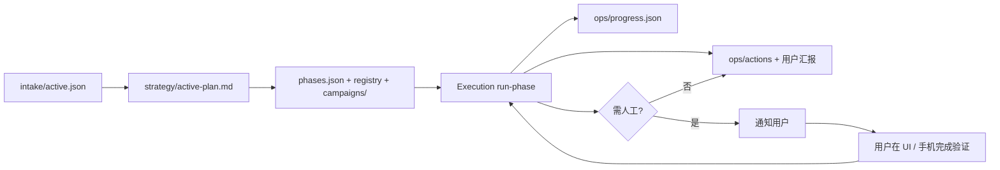

# 营销执行动作与脚本生成

本文档定义：Automation **如何根据用户需求** 制定/生成脚本，执行社媒账户与营销动作，并向用户汇报；以及在需要 **人工验证** 时如何通知用户。

> **全用户 · 全项目：** 每个 `projectId` 走同一套链路 — Planner 生成 phases + campaigns → Execution `run-phase` → 用户只看 `ops/progress.json`。见 [automation-commander.md](./automation-commander.md)。  
> 范围：产品行为定义。实现见 `campaigns/`、`runtime/orchestrator/`、Platform UI。

---

## 1. 总原则

| 原则 | 说明 |
|------|------|
| **Automation 总指挥** | **每个 Project** 由 Automation 分阶段写代码、运行、汇报；用户不执行 marketing todo |
| **需求驱动** | 脚本与 task 列表来自 intake + strategy，不是固定写死 |
| **按项目隔离** | phases、registry、campaigns、账户、动作日志均属于单个 `projectId` |
| **人机协同** | 注册、验证码、风控审核等 **必须** 可暂停并通知用户 |
| **可汇报** | 每个动作有可读摘要，汇总到 `ops/progress.json` / UI / 日报 / 周报 |
| **合规优先** | 频率限制、平台 ToS、禁止欺诈性批量养号；高风险动作需用户批准 |

---

## 2. 从需求到脚本的链路



### 2.1 Strategy Planner 输出（脚本层 + 阶段链）

根据 **该项目的** intake、feasibility、methods/regions catalog，Planner **生成或注册**：

| 产出 | 示例 |
|------|------|
| `runtime/orchestrator/phases.json` | 本项目阶段 id、taskIds、successCriteria、nextPhase |
| `campaigns/{channel}-{goal}/run.mjs` | `campaigns/facebook-leads/run.mjs` |
| `campaigns/.../config.json` | 频率、文案主题、目标地区 |
| `registry.json` 条目 | `id`, `command`, `channels`, `requiresDesktop` |
| `ops/progress.json` | 初始化任务列表与 currentPhase |
| `strategy/active-plan.md` § Automations | 人类可读：做什么、多久、风险 |

**规则：** 用户 intake 里未选择的渠道 **不生成** 对应脚本。

### 2.2 脚本能力类型（Action Types）

平台维护 **动作目录**（Action Catalog），Planner 从中组合本项目 task：

| 类别 | 动作 ID | 说明 | 典型运行环境 |
|------|---------|------|--------------|
| **账户** | `account.create` | 引导/自动化创建 FB、IG、X 等账户 | Local Worker + 浏览器 |
| **账户** | `account.login` | 登录并持久化 session | Local Worker |
| **账户** | `account.warmup` | 新号养号（浏览、轻互动） | Local Worker |
| **内容** | `content.post` | 发帖（图文/链接） | Local / Cloud |
| **内容** | `content.schedule` | 定时发帖队列 | Cloud |
| **获客** | `lead.search_groups` | 搜索目标群 / 话题 / hashtag | Local / Cloud |
| **获客** | `lead.search_profiles` | 按关键词找潜在用户 | Local |
| **获客** | `lead.comment` | 在帖子下评论引流 | Local |
| **关系** | `social.follow` | 关注目标账号 | Local |
| **关系** | `social.connect` | 加好友 / 发连接请求 | Local |
| **关系** | `social.dm` | 私信（冷启动或跟进） | Local / EC2 |
| **分析** | `metrics.collect` | 拉取互动、线索计数 | Cloud |

**Identity Gate（infra.*）：** 零营销客户在 Growth 前配置域名邮箱与测量 — 见 [greenfield-identity-gate.md](./greenfield-identity-gate.md)。**不是** 批量 Gmail 工厂。

具体渠道支持矩阵见 [§4](#4-渠道与动作矩阵)。

---

## 3. 社媒账户生命周期（每项目独立）

每个项目在 `accounts/`（逻辑路径）维护 **本项目专属** 账户池：

```
tenants/{userId}/projects/{projectId}/accounts/
├── registry.json          # 账户列表与状态
├── facebook/
│   └── {accountId}/
│       ├── meta.json      #  handle、创建时间、状态
│       └── session/       #  gitignore；Playwright storageState
├── instagram/
├── twitter/
└── ...
```

### 3.1 账户状态机

```
planned → creating → verification_required → active → paused → restricted → archived
                ↑              │
                └──────────────┘ 用户完成验证后恢复
```

| 状态 | 含义 | 用户可见 |
|------|------|----------|
| `planned` | 策略已规划，尚未创建 | 计划列表 |
| `creating` | 脚本正在打开注册流程 | 「创建中」 |
| `verification_required` | **需人工验证**（见 §6） | 红色待办 + 推送 |
| `active` | 可执行营销动作 | 正常 |
| `paused` | 用户或风控暂停 | 已暂停 |
| `restricted` | 平台限流/警告 | 需处理 |
| `archived` | 不再使用 | 历史 |

### 3.2 创建账户（account.create）

**输入（来自 intake / UI）：**

- 渠道：Facebook / Instagram / Twitter(X) / …
- 地区、语言、品牌人设
- 是否用户提供手机号 / 邮箱（Vault）
- 是否使用 **已有** 账户（跳过创建，仅 login）

**Automation / 脚本行为：**

1. 在 **Local Worker** 打开浏览器（Cloud 通常无法完成全套注册）
2. 尽可能自动填表；遇到验证码、短信、邮箱验证 → **立即转 verification_required**
3. 创建成功 → 保存 session → 状态 `active`
4. 写 action log + UI 通知

**限制（产品规则）：**

- 批量自动注册需用户在策略页 **明确批准**
- 不得伪造身份材料；需用户提供合法手机号/邮箱时通过 Vault 传入
- 违反平台 ToS 的地区/方式 → Planner 必须在策略中标注「不可自动」

### 3.3 账户就绪后的营销动作

账户 `active` 后，Execution 按 `plan.json` 优先级执行，例如：

```
Day 1–3:  account.warmup
Day 4+:   content.post + lead.search_groups
Week 2+:  social.connect / social.dm（需用户批准冷 DM）
```

所有动作绑定 `accountId`，日志可追溯到 **哪个号、做了什么**。

---

## 4. 渠道与动作矩阵

| 渠道 | 创建账户 | 发帖 | 找群/话题 | 加好友/关注 | 私信 | 人工验证常见场景 |
|------|----------|------|-----------|-------------|------|------------------|
| Facebook | ✅ 引导式 | ✅ | ✅ 群组 | ✅ 好友请求 | ✅ Messenger | 短信、照片验证、checkpoint |
| Instagram | ✅ 引导式 | ✅ | ✅ hashtag | ✅ 关注 | ✅ DM | 短信、邮箱、可疑登录 |
| Twitter (X) | ✅ 引导式 | ✅ | ✅ 搜索 | ✅ 关注 | ✅ DM | 手机、 Arkose 验证码 |
| Telegram | 通常已有号 | ✅ 频道 | ✅ 群搜索 | N/A | ✅ | 二次验证、新设备 |
| LinkedIn | 引导式 | ✅ | ✅ 群/搜索 | ✅ 连接 | ✅ InMail | 邮箱、人机验证 |

「✅ 引导式」= 脚本辅助 + **大量步骤需用户在场**（见 §6）。

---

## 5. 用户汇报（Reporting）

三层监控模型见 [marketing-integration-and-metrics.md](./marketing-integration-and-metrics.md) §3：**L1 执行** · **L2 渠道** · **L3 共创目标**。

用户 **不读原始脚本日志** 也能掌握进展。汇报分层：

| 层 | 路径 | 内容 |
|----|------|------|
| **活动时间线** | `ops/activity/events.jsonl` | 用户 + Automation **全部** 里程碑（分析、计划、代码、FB 创建、发帖…） |
| 动作明细 | `ops/actions/*.jsonl` | 单次 marketing action 字段级记录 |
| 日报/周报 | `ops/daily/`, `ops/weekly/` | 人类可读汇总 |

### 5.1 实时 / 近实时

| 渠道 | 内容 |
|------|------|
| **项目仪表盘** | 今日动作数、成功/失败、待办验证 |
| **App / 邮件 / Telegram _bot 通知** | 关键事件（见下） |
| **ops/actions/** | 结构化 JSON 行（机器读） |

**必通知事件：**

- 账户创建成功 / 失败
- **verification_required**（含 deep link 或截图）
- 每日配额用尽、被平台限流
- 发现 N 条潜在线索（lead）
- 脚本异常退出

### 5.2 动作日志格式（单条）

路径：`ops/actions/YYYY-MM-DD.jsonl`（每项目）

```json
{
  "ts": "2026-06-14T10:32:00Z",
  "projectId": "prj_xxx",
  "accountId": "ig_01",
  "channel": "instagram",
  "action": "content.post",
  "status": "success",
  "summary": "发布 1 条帖子：产品入门指南",
  "metrics": { "likes": 0, "comments": 0 },
  "artifact": "ops/artifacts/prj_xxx/2026-06-14-post-01.png"
}
```

### 5.3 汇总汇报

| 类型 | 路径 / UI | 频率 |
|------|-----------|------|
| **日报** | `ops/daily/YYYY-MM-DD-summary.md` + 仪表盘 | 每日 |
| **周报** | `ops/weekly/YYYY-Www-report.md` | 每周 |
| **策略进度** | UI「相对 KPI」widget | 持续 |

日报 **必须包含**（人类可读）：

- 各渠道账户状态表
- 今日执行动作清单（发帖 X、加好友 Y、入群 Z）
- 潜在线索 / 互动摘要
- **待用户处理事项**（验证、批准、补充凭证）
- 明日计划（来自 active-plan）

---

## 6. 人工验证与人机协同（Human-in-the-Loop）

当脚本检测到 **无法自动完成** 的步骤时，必须：

1. **暂停** 该 `accountId` 或该 task（不继续刷动作）
2. 状态 → `verification_required`
3. **通知用户**（多渠道）
4. 在 UI 展示 **待办卡片**：说明要做什么、截止建议、截图/链接
5. 用户完成后点击 **「我已完成验证」** 或 Worker 检测到 session 恢复 → 继续执行

### 6.1 典型人工步骤

| 场景 | 用户需做什么 | UI 展示 |
|------|--------------|---------|
| 短信验证码 | 在手机上收码并输入 | 提示 + 可选「在 Worker 浏览器中打开」 |
| 邮箱验证 | 点邮件链接 | 链接说明 |
| CAPTCHA / 人机 | 用户在浏览器完成 | 截图 + RDP/远程桌面指引 |
| 身份/照片验证 | 用户自行上传 | 状态跟踪 |
| 新设备登录确认 | App 内点确认 | 步骤说明 |
| 广告/开户审核 | 等待平台审核 | 仅跟踪，不重复提交 |

### 6.2 通知方式与催促策略（全 obligation 统一）

| 方式 | 用途 |
|------|------|
| 项目仪表盘「待办收件箱」 | 默认；所有 open obligation |
| 邮件 | 每次 reminder 批次 |
| Web Push | 48h+ 可选 |
| Telegram / Slack webhook | 用户配置的 ops 频道 |
| SMS（Twilio） | 高优先级 verification（可选） |

配置：`runtime/notifications.json`（项目）+ `tenants/{userId}/notifications.json`（用户默认）  
**完整策略（0/24/48/72h + 每周、Snooze、quiet hours）：** [user-activity-and-notifications.md](./user-activity-and-notifications.md)

### 6.3 超时与升级（默认）

| 条件 | 行为 |
|------|------|
| 创建 obligation | 立即 in-app + email |
| 24h / 48h / 72h 未处理 | 按 schedule 重复提醒 |
| 72h 后 | 每周一次，直至完成或 maxReminders |
| 用户 Snooze | 暂停至 snoozedUntil |
| 用户完成 | 停止提醒；Automation 续跑 |
| 72h+ 仍未处理 | Weekly Review 提及；仪表盘标红 |

---

## 7. Automation 职责划分

| Automation | 与执行动作的关系 |
|------------|------------------|
| **Strategy Planner** | 根据 intake **选择动作组合**，生成 campaigns + registry |
| **Execution Runner** | 调度脚本；写 action log；触发 verification 通知 |
| **Weekly Review** | 根据动作效果调整 frequencies、deprioritize 动作 |
| **Onboarding** | 收集「是否已有 FB/IG/X 账户」「是否允许自动创建新号」 |

Execution Runner **不** 在 verification_required 期间强行重试注册。

---

## 8. 安全与合规（产品约束）

- 每账户、每渠道 **独立 rate limit**（`campaigns/*/config.json` + 全局 safety）
- 冷 DM / 加好友 **默认关闭**，策略页勾选 + 用户一次批准后才 enabled
- 禁止：购买假账号、绕过 CAPTCHA 的非法服务、垃圾信息轰炸
- 所有 outbound 动作可在 UI **一键暂停本项目**
- 账户 session 仅存在 Worker + Vault，不进 git

---

## 9. 与仓库目录的对应

| 概念 | 路径（每 projectId） |
|------|----------------------|
| 账户注册表 | `accounts/registry.json` |
| 会话 | `accounts/{channel}/{id}/session/` |
| 营销脚本 | `campaigns/{slug}/` |
| 任务注册 | `runtime/orchestrator/registry.json` |
| 动作日志 | `ops/actions/*.jsonl` |
| 日报 | `ops/daily/*-summary.md` |
| 通知配置 | `runtime/notifications.json` |
| 待办验证 | `ops/pending-human.json` |
| 用户活动 | `ops/activity/events.jsonl` |
| 事件类型目录 | `runtime/user-activity-events-catalog.json` |

---

## 10. 相关文档

- [PRD.md](./PRD.md) §5.7–5.9
- [user-journey.md](./user-journey.md) — 账户与验证阶段
- [features.md](./features.md) — F8 验收
- [multi-tenant-model.md](./multi-tenant-model.md) — 项目隔离
