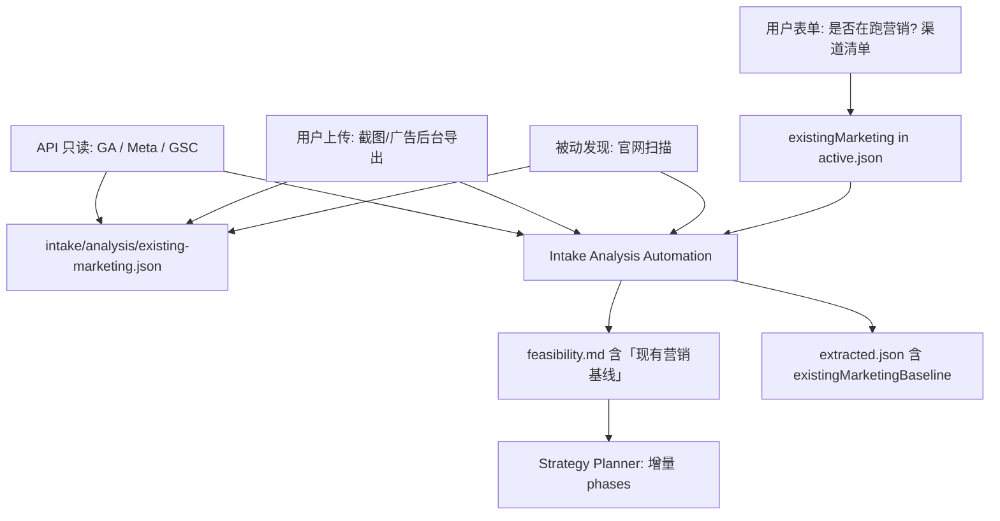

# 现有营销盘点与增量策略

Intake 阶段除收集产品资料外，必须 **了解用户当前已在进行的市场营销活动**（官网 SEO、Facebook、GA4、Google Ads 等）。  
Automation **主动发现 + 向用户索取** 缺失信息，在 **现有基础上** 规划增量营销，而非从零假设空白 slate。

> 全用户 · 全项目：每个 `projectId` 独立 `existingMarketing` 与 `existing-marketing.json`。  
> 机器目录：`runtime/existing-marketing-channels-catalog.json`  
> 数据 schema：`intake/existing-marketing.schema.json`

---

## 1. 产品目标

| 目标 | 说明 |
|------|------|
| **现状感知** | 知道用户已在哪些渠道投入、大致效果如何 |
| **避免重复** | 不重新建已有 GA/像素/主页，优先 **优化、扩展、联动** |
| **增量规划** | Strategy 区分：**延续 / 修复 / 新增** 三类动作 |
| **基线 KPI** | 有 GA/广告 API 时，用真实基线定目标；无则标注「待连接后补基线」 |
| **按需索取** | 仅对 **已声明或已发现** 的渠道向用户要凭证/链接 |

用户应看到：**「我们发现了什么 → 还缺什么信息 → 在现有基础上建议加什么」**。

---

## 2. 信息来源（三层）



### 2.1 用户主动提供（UI 表单）

Intake 必问：

1. **是否已有正在进行的营销活动？** `existingMarketing.hasActiveMarketing`  
2. **渠道记录**（来自 catalog，UI 按 **uiGroup** 分组展示；存储仍用具体 `channelId`）：
   - **Website & measurement** — SEO、GA4、GTM、Meta Pixel  
   - **Organic social** — Facebook、Instagram、LinkedIn、X  
   - **Paid advertising** — Meta Ads、Google Ads（Intake 可选填月花费 USD）  
   - **Email & CRM** — 邮件营销、CRM  
3. **每渠道简要状态**：进行中 / 暂停 / 仅计划 / 没有  
4. **已知 ID/链接**（有则填）：  
   - 官网 URL（通常已有 `product.url`）  
   - GA4 Measurement ID（`G-XXXX`）  
   - Facebook 主页 URL、Instagram handle  
   - Meta 广告账户 ID（可选）  
   - Google Ads Customer ID（可选）  
5. **自由描述**：`existingMarketing.userSummary` — 「我们每月在 Facebook 投 $500，SEO 做了 3 个月…」

**规则：** 用户声明 `active` 的渠道 → Analysis **必须** 尝试发现或列出 `assetsNeededFromUser`。

### 2.2 Automation 被动发现（无需凭证）

对 `product.url` 及 materials 中的 URL 执行 **站点技术扫描**（Cloud Worker / Automation）：

| 检测项 | 用途 |
|--------|------|
| `<title>` / meta description / H1 | SEO 现状粗评 |
| `sitemap.xml` / `robots.txt` | 索引与抓取配置 |
| canonical、hreflang、schema.org | 国际化与技术 SEO |
| 页内脚本 | GA4 (`gtag`/`G-`)、GTM、Meta Pixel (`fbq`) |
| 页脚/社交链接 | Facebook、Instagram、LinkedIn、X |
| 订阅表单 / Mailchimp-Klaviyo 脚本 | 邮件营销线索 |
| OG/Twitter Card | 社交分享配置 |

产出写入 `intake/analysis/existing-marketing.json`：

```json
{
  "discoveredAt": "2026-06-14T12:00:00Z",
  "siteUrl": "https://example.com",
  "passiveScan": {
    "seo": { "hasSitemap": true, "titlePresent": true, "issues": [] },
    "tags": { "ga4MeasurementId": "G-XXXX", "gtmContainerId": null, "metaPixelId": "123" },
    "socialLinksFound": ["facebook", "instagram"]
  },
  "confidence": "medium"
}
```

**禁止：** 在未获授权时登录用户广告后台或读取 GA 账户数据。

### 2.3 用户资料推断

上传 **广告截图、Analytics 报表 PDF、Search Console 导出** → material-notes 提取：

- 是否在跑 campaign、大致预算、CTR、关键词  
- 与 passive scan **交叉验证**，冲突时在 feasibility 中 **向用户确认**

### 2.4 API 只读（凭证门控，可选深化）

用户声明某渠道 **active** 且愿意授权时，通过 Vault 只读凭证拉取摘要：

| 渠道 | credentialChannelId | 可读摘要（示例） |
|------|---------------------|------------------|
| GA4 | `google_analytics` | 28 天 sessions、top landing、conversions |
| Search Console | `google_search_console` | top queries、clicks、coverage |
| Meta | `meta` | 主页帖文频率、广告 campaign 名、近 30 天 spend |
| Google Ads | `google_ads` | active campaigns、spend、转化 |

**门控：** 无凭证时仍完成 passive + 用户表单分析；在 `assetsNeededFromUser` 中标记 **recommended**，不阻塞 feasibility 生成。

---

## 3. 数据模型

### 3.1 `intake/active.json` → `existingMarketing`

见 [intake/template.json](../../intake/template.json) 与 [existing-marketing.schema.json](../../intake/existing-marketing.schema.json)。

### 3.2 `intake/analysis/existing-marketing.json`

Analysis Automation 输出，合并：

- `userDeclared` — 来自表单  
- `passiveScan` — 站点扫描  
- `materialInferences` — 资料推断  
- `apiSnapshot` — 有凭证时的只读摘要（可为 null）  
- `reconciled` — 合并后每 channel 的 `status`、`confidence`、`gaps[]`  
- `assetsNeededFromUser[]` — 仍缺字段及原因  

### 3.3 `extracted.json` 扩展

```json
{
  "existingMarketingBaseline": {
    "channelsActive": ["website_seo", "google_analytics", "facebook_organic"],
    "channelsDetectedOnly": ["meta_pixel"],
    "channelsUserSaidNone": ["google_ads"],
    "topGaps": ["GA4 ID found on site but no API access for baseline metrics"],
    "recommendedIncrementalMethods": ["content_marketing", "meta_ads"]
  }
}
```

---

## 4. 可行性报告（feasibility.md）必含章节

在 template 中增加 **§ 现有营销基线**：

1. **您告诉我们** — 用户声明摘要  
2. **我们自动发现** — 扫描/资料/API 结果（标注 confidence）  
3. **不一致待确认** — 例如：页上有 Pixel 但用户说没投广告  
4. **仍缺信息** — `assetsNeededFromUser` 列表（链到 UI 补全）  
5. **增量建议方向** — 在现有基础上：  
   - **Continue** — 继续并优化（如 SEO 内容、主页发帖）  
   - **Fix** — 修复缺口（sitemap、转化追踪、像素事件）  
   - **Add** — 新增手段（用户未做但 catalog 推荐且 feasibility 为 H/M）  

**禁止：** 建议「从零新建 GA」当 passive scan 已发现 GA4 已安装 — 应建议 **连接 API 读基线 + 优化事件**。

---

## 5. Strategy Planner 如何使用

Planner 读取 `existing-marketing.json` + `existingMarketingBaseline`：

| 决策 | 规则 |
|------|------|
| Phase 1 任务 | 优先 **audit/fix/connect** 现有栈，再 **add** 新渠道 |
| 跳过创建 | 已有 Facebook 主页 → task 为 `optimize_page` / `content.post`，非 `account.create` |
| KPI 基线 | 有 API snapshot → 写入 strategy KPI 表 baseline；无 → `baseline: TBD — connect GA4` |
| 凭证请求 | 仅对 **本策略要用** 且 **existing 渠道需深读** 的 API 请求 Vault |
| phases 命名 | 示例：`phase_01_baseline_audit` → `phase_02_incremental_growth` |

`strategy/active-plan.md` 必须含 **§ Current marketing stack** 与 **§ Incremental plan (build on existing)**。

---

## 6. UI 要求

| 模块 | 功能 |
|------|------|
| **现有营销问卷** | 是否在做、渠道多选、每渠道状态与链接/ID |
| **发现结果卡片** | 展示 passive scan：已检测到 GA/Pixel/社交链接 |
| **缺口清单** | `assetsNeededFromUser` — 一键跳转凭证页或补字段 |
| **确认 CTA** | 用户确认「现状理解正确」后再进完整 Planner（可与 feasibility 合并确认） |

---

## 7. Automation 分工

| Automation | 职责 |
|------------|------|
| **Onboarding** | 收集 `existingMarketing` 表单字段 |
| **Intake Analysis** | passive scan + 合并 existing-marketing.json + feasibility 基线章节 |
| **Strategy Planner** | 增量 phases/campaigns，不重复建设已有资产 |
| **Execution** | 连接类 task（如 `metrics.collect_ga4`）在凭证就绪后跑 |

---

## 8. 验收标准

见 [features.md](./features.md) § F1.6。

---

## 9. 相关文档

- [intake-and-materials.md](./intake-and-materials.md)  
- [integration-marketing-catalog.md](./integration-marketing-catalog.md)  
- [PRD.md](./PRD.md) §5.1  
- [automation-commander.md](./automation-commander.md)
