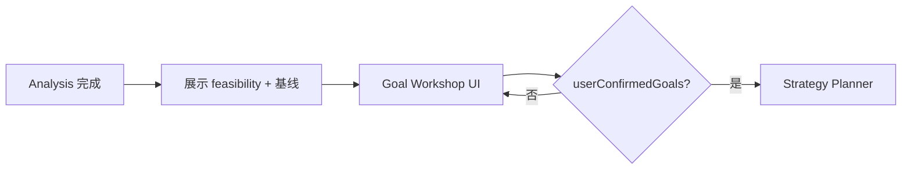

# Goal Workshop — 市场目标共创

**可行性分析 ≠ 已承诺的目标。**  
Analysis 完成后、Strategy Planner 之前，必须与用户 **一起制定** 可测量的市场营销目标（用户数、访问量、线索、收入等）。

> Intake 流程：[intake-and-materials.md](./intake-and-materials.md) §5.4  
> Planner 消费：`goals.confirmed` + `goals.measurement`  
> 监控对齐：[marketing-integration-and-metrics.md](./marketing-integration-and-metrics.md) §3.3

---

## 1. 为什么要单独一步

| 阶段 | 回答的问题 |
|------|------------|
| **Intake Analysis** | 我们理解什么？市场是否可行？Continue/Fix/Add？ |
| **Goal Workshop** | **这个项目要达成什么数字、何时、怎么衡量？** |
| **Strategy Planner** | 如何用 phases/campaigns 去实现 **已确认** 的目标 |

**禁止：** Automation 编造 KPI 数值；Planner 在 `userConfirmedGoals !== true` 时不得生成 execution 脚本（与 feasibility 门禁并列）。

---

## 2. 流程位置



**顺序门禁：**

1. `materials.userConfirmedAnalysis === true` — 认可可行性方向  
2. `goals.userConfirmedGoals === true` — 认可目标与测量方式  
3. 然后触发 Planner  

---

## 3. UI / 对话内容（与用户共创）

### 3.1 主目标

| 字段 | 说明 |
|------|------|
| `goals.primaryKpi` | 枚举见下表 |
| `goals.targetValue` | 用户与系统一起填的数字 |
| `goals.deadline` | ISO 日期 |
| `goals.primaryLabel` | 可选展示名，如「付费客户数」 |

**primaryKpi 枚举（可扩展）：**

| key | 含义 | 典型测量源 |
|-----|------|------------|
| `signups` | 注册用户数 | GA4 事件 / **product DB** |
| `active_users` | 月活/周活 | **product DB** |
| `waitlist` | 候补名单 | 表单工具 / DB |
| `traffic` | 站点访问量 | GA4 sessions |
| `leads` | 销售线索 | CRM / 表单 |
| `revenue` | 收入/MRR | Stripe / **product DB** |
| `paid_customers` | 付费客户数 | Stripe / DB |
| `brand_awareness` | 品牌曝光（弱化数字） | 社媒 reach + 定性 |

### 3.2 次要目标（可选）

`goals.secondary[]` — 同上结构，Planner 用于 Review 次要优化。

### 3.3 测量定义（关键）

`goals.measurement`：

```json
{
  "primary": {
    "source": "ga4_event",
    "eventName": "sign_up",
    "propertyId": "G-XXXX",
    "fallbackSource": "product_db",
    "dbMappingId": "signup_count"
  },
  "baseline": {
    "value": null,
    "asOf": null,
    "status": "unknown"
  },
  "notes": "Activation = completed onboarding step 3"
}
```

| source | 说明 |
|--------|------|
| `ga4_event` | GA4 自定义事件 |
| `gsc` | 仅 traffic/SEO 类目标 |
| `product_db` | 见 [product-data-connectors.md](./product-data-connectors.md) |
| `metrics_api` | 客户提供的只读 REST |
| `stripe` | 收入类 |
| `manual` | 用户每周手填（最后手段） |

**baseline unknown：** Planner Phase 1 必须含 **connect measurement + establish baseline** task，不得直接承诺 Phase 3 达成 target。

### 3.4 约束与预期（ realistic ）

UI 展示 Analysis 中的 **realistic 区间**（如「有机社媒首条 lead 常 2–4 周」），用户仍可选择更激进 target，但策略须注明风险。

| 字段 | 说明 |
|------|------|
| `goals.budgetCeilingUsd` | 可继承 `marketing.budgetMonthlyUsd` 或单独确认 |
| `goals.riskAcknowledged` | 用户勾选「理解目标与周期」 |

### 3.5 确认

| 字段 | 说明 |
|------|------|
| `goals.userConfirmedGoals` | `true` 解锁 Planner |
| `goals.confirmedAt` | ISO 时间 |
| `goals.confirmedSummary` | 一句人话，写入 activity + strategy 摘要 |

---

## 4. 写入 intake 与 strategy

- 更新 `intake/active.json` 的 `goals` 块  
- append activity：`goals.workshop_completed`（actor: user）  
- Planner 读取后，`strategy/active-plan.md` **KPI 表** 必须：

| 列 | 来源 |
|----|------|
| Metric | `goals.primaryKpi` + label |
| Baseline | `goals.measurement.baseline` 或 TBD + 建立 baseline 的 task |
| Target | `goals.targetValue` |
| Deadline | `goals.deadline` |
| Source | `goals.measurement.primary.source` |

---

## 5. 与催促通知

Goal Workshop 未完成（analysis 已完但 `userConfirmedGoals !== true`）→ obligation **`goals_unconfirmed`**，按 [user-activity-and-notifications.md](./user-activity-and-notifications.md) 定期提醒。

---

## 6. 验收标准

见 [features.md](./features.md) § F13。

---

## 7. 相关文档

- [PRD.md](./PRD.md) §5.1、§5.2  
- [user-journey.md](./user-journey.md)  
- [intake/goals.schema.json](../../intake/goals.schema.json)
