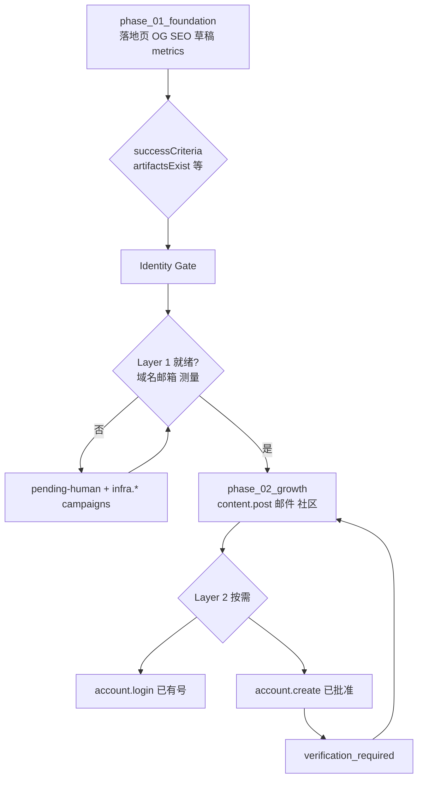

# Greenfield Identity Gate（零营销客户的身份门禁）

当用户 **`existingMarketing.hasActiveMarketing = false`**（或等效的「渠道全 0」）时，Phase 1（foundation）往往 **很快** 跑完 artifact（落地页、OG、内容草稿、测量脚本）。  
**Phase 2（growth）** 及以后的 `content.post`、Newsletter、社媒注册等 **依赖品牌身份栈** — 本门禁定义：**何时建、建什么、哪些脚本自动、哪些必须等人**。

> Phase 与日历：**phase id 可与 `week_1` 等示例命名并存，但与「必须跑满 7 天」无强制对应** — 见 [automation-commander.md](./automation-commander.md) §8。  
> 账户生命周期：[execution-and-actions.md](./execution-and-actions.md) §3 · 动作目录：`runtime/action-catalog.json`

---

## 1. 问题陈述

| 常见误解 | 产品立场 |
|----------|----------|
| Phase 1 快 → 立刻要批量建 Gmail + 注册所有社媒 | Phase 1 **多数 task 不需要** 新社媒号；快的是 artifact，不是「身份已齐」 |
| 0 营销 → 第一天 Automation 静默建齐所有账号 | **分阶段 Identity Gate**；高风险动作默认 disabled |
| 社媒注册要邮箱 → 必须自动建邮箱工厂 | 用 **品牌域名邮箱** 或用户 Vault 提供的合法邮箱；**禁止** 批量 disposable Gmail |

**Identity Gate** = Phase 1 `successCriteria` 满足后、**进入 Growth phase 之前**（或并行）必须通过的 **身份/凭证/测量** 检查与半自动 setup tasks。

---

## 2. 身份栈（Identity Stack）

```
Layer 0 — 已有（几乎必有）
  用户注册 Marketing Autopilot 的联系邮箱
  → 收通知、pending-human、部分 OAuth

Layer 1 — 品牌基础（Identity Gate 核心）
  自定义域名（可选但强烈建议）
  品牌邮箱 hello@product.com（SES / Resend / Workspace）
  GA4 / 测量 OAuth 或 Service Account

Layer 2 — 渠道账号（按需，intake 选了才做）
  已有号 → account.login + session
  无号   → account.create（引导式）+ verification_required

Layer 3 — 放大（Phase 3+，批准门）
  广告 BM、ESP 大规模发送、outbound DM
```

**Planner 规则：** Phase 2 中任何 `channelsPreferred` 所需的 Layer 2 **未就绪** → task `enabled: false` 或 phase 阻塞于 Identity Gate obligation。

---

## 3. 与 Phase 的关系



| 概念 | 说明 |
|------|------|
| **Phase 1 执行时间** | 一次 `run-phase` 可能 **分钟～小时** |
| **Identity Gate 停留时间** | 取决于域名 DNS 传播、OAuth、用户是否购买域名 — **可能几小时～数天** |
| **Phase 2 开始** | `identityGateStatus === passed` **且** Growth phase 所需 Layer 2 满足 **或** 对应 task 仍 disabled 但不阻塞其他手段 |

**不在 Phase 1 默认批量执行：** `account.create`、批量邮箱注册。

---

## 4. Intake 字段

`intake/active.json` → `identity`（见 [intake/template.json](../../intake/template.json)）：

| 字段 | 用途 |
|------|------|
| `identity.hasCustomDomain` | 是否已有/将购买域名 |
| `identity.domain` | 如 `example.com` |
| `identity.brandEmailDesired` | 如 `hello@example.com` |
| `identity.brandEmailStatus` | `unknown` / `pending_dns` / `active` / `skipped` |
| `identity.contactEmail` | 对外联系邮箱（默认可等于用户账号邮箱） |
| `identity.identityGateStatus` | `pending` / `in_progress` / `passed` / `blocked` |
| `identity.identityGatePassedAt` | ISO 时间 |

与已有字段联动：

- `marketing.accountStrategy.useExistingAccounts` — true 时优先 `account.login`，跳过 create  
- `marketing.accountStrategy.allowAutoCreateAccounts` + `actionsApproved.accountCreate` — 才允许 Planner 启用 `account.create`  
- `existingMarketing.hasActiveMarketing === false` → Analysis 标注 **greenfield**；Planner Phase 1 **不含** bulk 社媒 create

---

## 5. 动作目录（infra.*）

机器可读：`runtime/action-catalog.json` → channel `infrastructure` + actionTypes `infra.*`。

| actionType | 标签 | 风险 | 默认批准 | Automation 行为 |
|------------|------|------|----------|-----------------|
| `infra.domain_dns` | 域名 DNS 引导/配置 | medium | 否 | 生成 TXT/CNAME 说明；可选 Cloudflare API；写 pending-human 直到验证通过 |
| `infra.email_setup` | 品牌邮箱（SES/Resend/Workspace） | medium | 否 | 创建发信身份、DKIM/SPF 记录、发测试信；**不用** 批量 Gmail |
| `infra.measurement_connect` | 接 GA4/GSC OAuth 或 SA | low | 否 | 引导 OAuth；写 `credentialsProvided`；establish-baseline 前置 |
| `infra.cta_hosting` | 落地页/Waitlist 托管 | low | 否 | S3/托管 deploy 或输出 deploy-notes；可阻塞于 `WAITLIST_FORM_URL` |

**禁止作为产品默认动作（不进入 catalog 或 Pack 外）：**

- `infra.disposable_email_create` — 批量临时邮箱  
- 无用户批准的批量 `account.create`

---

## 6. Planner 产出示例（greenfield）

**phase_01_foundation** `taskIds`（无社媒 create）：

- `foundation-waitlist`
- `foundation-og`
- `foundation-seo-audit`
- `foundation-content-drafts`
- `metrics-daily`

**Identity Gate**（独立 phase 或 foundation 末尾 tasks，推荐 **`phase_01b_identity`** 或 gate tasks 附在 foundation 的 `successCriteria` 之后）：

- `identity-domain-dns` → `infra.domain_dns`
- `identity-brand-email` → `infra.email_setup`
- `identity-ga4-connect` → `infra.measurement_connect`

`successCriteria` 示例：

```json
{
  "identityGateRequired": true,
  "identityFields": {
    "brandEmailStatus": ["active", "skipped"],
    "measurementConnected": true
  },
  "artifactsExist": [
    "campaigns/foundation-waitlist/output/index.html"
  ]
}
```

**phase_02_growth**（Identity Gate `passed` 后）：

- `growth-content-en` — 草稿发布（`content.post` 若已有 X/LinkedIn session）
- `growth-newsletter-setup` — 依赖 `infra.email_setup` active
- `growth-fb-page` — `account.login` 或 **已批准** `account.create`

---

## 7. Obligation Scanner

| obligation type | 条件 | 催促 |
|-----------------|------|------|
| `identity_domain_missing` | greenfield + Phase 2 需要品牌邮箱 + 无 `identity.domain` | 24h 起 |
| `identity_dns_pending` | `brandEmailStatus === pending_dns` | 48h 起 |
| `identity_measurement_missing` | goals.measurement 需 ga4 + 未连接 | 立即 |
| `identity_social_missing` | Growth 含 channel 但 accounts/registry 无 active | 立即 |
| `account_create_approval` | Planner 建议 create 但 `actionsApproved.accountCreate === false` | 策略页 |

写入 `ops/pending-human.json` + `tenants/{userId}/notifications`。

---

## 8. 用户可见 copy（UI）

**Identity Gate 卡片标题：** 「建立品牌身份（再开始渠道推广）」

| 状态 | 用户看到 |
|------|----------|
| 待域名 | 「请绑定域名或选择先用现有邮箱继续（跳过品牌邮箱）」 |
| DNS 待验证 | 「请在注册商添加以下 DNS 记录 — Automation 已生成清单」 |
| 测量待连接 | 「连接 Google Analytics — 约 2 分钟」 |
| 社媒待绑定 | 「绑定已有 Facebook 主页 **或** 在策略页批准创建新账号」 |
| 验证中 | 「Facebook 需要短信验证 — 请在手机完成」 |

**禁止 UI 文案：** 「请手动注册 Gmail / 请本周自己开 FB 号」— 应为 **「Automation 已打开注册流程 / 请完成验证」** 或 **「绑定已有账号」**。

---

## 9. Activity 事件

使用 [user-activity-events-catalog.json](../../runtime/user-activity-events-catalog.json) 扩展（实现时）：

- `identity.gate_started`
- `identity.dns_records_generated`
- `identity.email_setup_completed`
- `identity.measurement_connected`
- `identity.gate_passed`
- `identity.gate_blocked`

---

## 10. 验收标准

见 [features.md](./features.md) § F15。

---

## 11. 相关文档

| 文档 | 关系 |
|------|------|
| [existing-marketing-discovery.md](./existing-marketing-discovery.md) | greenfield vs 有存量 |
| [execution-and-actions.md](./execution-and-actions.md) | account.create / verification |
| [marketing-integration-and-metrics.md](./marketing-integration-and-metrics.md) | Layer A/B/C 与 Phase 命名 |
| [user-journey.md](./user-journey.md) | Identity Gate 在旅程中的位置 |
| [integration-marketing-catalog.md](./integration-marketing-catalog.md) | Planner 展开 linkedActions |

---

*文档版本：与 PRD v0.2 对齐。Catalog 变更请同步 `action-catalog.json` 与 [features.md](./features.md) § F15。*
