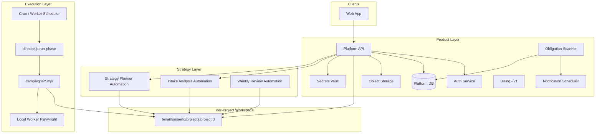
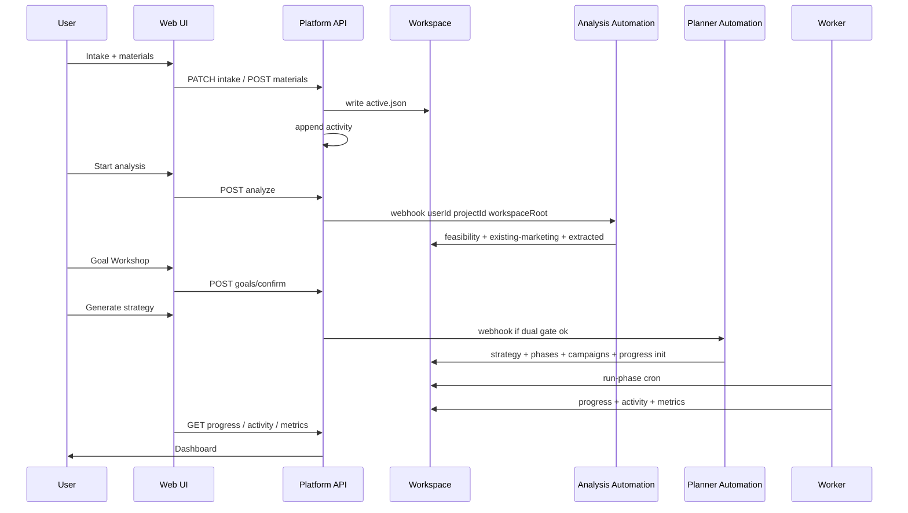

# 产品实现技术文档

将 [PRD.md](./PRD.md) 及 `docs/product/` 下产品定义 **映射为可实现的系统架构、模块、接口、数据与分阶段交付**。  
读者：平台后端、前端、DevOps、Automation 集成工程师。

> 高层架构图：[../architecture.md](../architecture.md)  
> 部署运维：[../deployment-guide.md](../deployment-guide.md)  
> 验收标准：[features.md](./features.md)  
> 版本节奏：[roadmap.md](./roadmap.md)

---

## 1. 文档范围与原则

### 1.1 产品形态

| 层级 | 职责 | 客户是否可见 |
|------|------|--------------|
| **Product Layer** | Web UI + Platform API + Vault + 通知/计费 | ✅ 唯一入口 |
| **Strategy Layer** | Cursor Automations：Analysis、Planner、Review | ❌ |
| **Execution Layer** | `director.js` + campaigns + Worker（Cloud/EC2/Local） | ❌ |

**Invariant（必须实现）：**

- 每个 `projectId` 独立工作区；API/Automation **强制** `userId` + `projectId`  
- Automation 总指挥：Planner → phases + campaigns → `run-phase` → `ops/progress.json`  
- 用户只看 progress / activity / metrics；**不** 收手工 marketing todo  
- 双门禁：`userConfirmedAnalysis` + `userConfirmedGoals` 后才 Planner 生成 execution  
- 活动日志：用户 + Automation 全量 → `events.jsonl`  
- 缺用户输入 → obligation + Notification scheduler 定期催促  

### 1.2 本仓库当前状态（v0.1 → v0.2）

| 已有 | 路径 | 用途 |
|------|------|------|
| 单项目模板 | `intake/`, `strategy/`, `runtime/`, `ops/` | Provisioning 复制源 |
| Orchestrator | `runtime/orchestrator/director.js` | validate / run-phase / execute |
| Campaign 库 | `runtime/campaign-lib/helpers.mjs` | progress、logAction、logActivity |
| Catalog JSON | `runtime/*-catalog.json` | UI 推荐、Planner、metrics |
| Automation 指令 | `automations/instructions/*.txt` | Cursor Agent prompt |
| Dogfood 示例 | `projects/marketing-autopilot-launch/` | 端到端参考 |
| 产品文档 | `docs/product/*` | 需求与验收 |
| **Platform 实现** | `platform/` | **v0.2 进行中** — `api/` 05 analyze 已 skeleton |

---

## 2. 系统架构

### 2.1 逻辑架构



### 2.2 工作区存储策略（二选一或混合）

| 方案 | 适用 | 实现要点 |
|------|------|----------|
| **A. 对象存储 + DB 索引** | SaaS 默认 | S3/GCS prefix `tenants/.../`；API 读写 JSON/文件；大 materials 存 blob |
| **B. Git 子仓库 / 分支 per project** | Automation 强依赖 git push | Platform 创建空 repo；Cursor 绑定 project repo URL |
| **C. 平台 monorepo 路径** | 早期 dogfood | 与现仓库相同；**必须** API 层 path ACL |

推荐 **v0.2：A + 可选 B**（Automation webhook 带 `workspaceRoot` URI）。

### 2.3 运行时放置

| 任务类型 | 运行环境 | 代码位置 |
|----------|----------|----------|
| Intake Analysis / Planner / Review | Cursor Cloud Automation | `automations/instructions/` |
| `run-phase`、metrics collect | Platform Worker 容器 | `platform/worker` 调 `director.js` |
| 无登录浏览器任务 | Cloud | campaigns |
| FB/IG + session | Local Worker per project | `accounts/{channel}/session/` |
| Telegram 长连接 | EC2/VPS | `infra/ec2` |

环境变量：**必须** `PROJECT_ROOT` 或 `WORKSPACE_URI` + `USER_ID` + `PROJECT_ID`。

---

## 3. 推荐技术栈（v0.2）

| 组件 | 建议 | 说明 |
|------|------|------|
| Platform API | Node 20 + Fastify 或 NestJS | 与 orchestrator 同语言 |
| Platform DB | MySQL 8 | users, projects, billing, notification state；dev 与 Kids Guard 同机 Docker，**独立库** `marketing-autopilot-dev` |
| Auth | Clerk / Auth0 / 自建 JWT | 邮箱 OAuth |
| Object storage | S3 兼容 | materials、大文件 |
| Vault | AWS Secrets Manager / HashiCorp | `MA_{projectId}_*` 命名 |
| Web | Next.js App Router | SSR 仪表盘 + intake 向导 |
| Queue | Redis + BullMQ 或 SQS | Analysis 异步、notification |
| Email | Resend / SES | obligation 催促 |
| Billing | Stripe | v1.0；v0.2 可只做 quote 预览 |
| Worker | Docker on ECS/Fly | `npm run marketing:phase` |

栈可替换；**接口契约**（§5）与 **工作区布局**（§4）不可变。

---

## 4. 数据模型

### 4.1 Platform DB（元数据）

```sql
-- 概念模型；具体 migration 由 platform/api 实现

users (user_id PK, email, created_at, notifications_json)

projects (project_id PK, user_id FK, name, status, workspace_uri,
          created_at, archived_at)

project_members (project_id, user_id, role)  -- v1.0 seat

automation_runs (run_id, project_id, automation_name, status,
                 correlation_id, started_at, finished_at)

obligations (obligation_id, project_id, type, status,
             next_remind_at, remind_count, snoozed_until, payload_json)

billing_subscriptions (user_id, plan, scope_multiplier, stripe_sub_id)
```

**不在 DB 存：** 策略正文、campaign 源码、凭证明文 — 在工作区或 Vault。

### 4.2 项目工作区（文件契约）

完整树见 [multi-tenant-model.md](./multi-tenant-model.md)。实现 **Provisioning** 时必须复制：

```
tenants/{userId}/projects/{projectId}/
├── intake/active.json              ← UI 写入
├── intake/analysis/                ← Analysis Automation
├── strategy/active-plan.md         ← Planner
├── runtime/orchestrator/
│   ├── phases.json
│   ├── registry.json
│   └── plan.json
├── runtime/notifications.json      ← 可选覆盖
├── runtime/user-inputs.json
├── runtime/credentials/refs.json
├── runtime/marketing/utm.json      ← Planner 生成
├── campaigns/{slug}/run.mjs
├── ops/progress.json               ← ★ UI 进度真相源
├── ops/pending-human.json
├── ops/activity/events.jsonl       ← ★ 统一时间线
├── ops/state/metrics.json          ← L2/L3 聚合
├── ops/actions/*.jsonl
└── materials/                      ← blob 或 URI 索引
```

用户级：

```
tenants/{userId}/
├── activity/events.jsonl
├── notifications.json
└── notifications/delivery.jsonl
```

### 4.3 Intake 关键字段（实现校验）

| 块 | 门禁 / 用途 |
|----|-------------|
| `materials.userConfirmedAnalysis` | Goal Workshop 前置 |
| `goals.userConfirmedGoals` | Planner 前置 |
| `goals.measurement` | metrics L3、KPI 表 source |
| `existingMarketing` | 盘点 + Fix/Add phases |
| `productData` | v0.3+ DB/API collect |

Schema：`intake/template.json`、`intake/goals.schema.json`、`intake/product-data.schema.json`。

### 4.4 Catalog 只读服务

Platform API 加载并缓存：

- `runtime/marketing-methods-catalog.json`
- `runtime/regions-catalog.json`
- `runtime/action-catalog.json`
- `runtime/existing-marketing-channels-catalog.json`
- `runtime/metrics-sources-catalog.json`
- `runtime/user-activity-events-catalog.json`

`GET /api/catalog/recommendations?regions=US,EU` → UI Intake 高亮推荐手段。

---

## 5. Platform API 契约（v0.2 最小集）

所有 project 路由：`Authorization` + 校验 `project.userId === auth.userId`。

### 5.1 账号与项目

| Method | Path | 行为 |
|--------|------|------|
| POST | `/api/auth/register` | 创建 user；写 `user.registered` activity |
| POST | `/api/auth/login` | session/JWT |
| GET | `/api/projects` | 列表 |
| POST | `/api/projects` | Provisioning + `project.created` |
| GET | `/api/projects/:id` | meta + 摘要 status |
| PATCH | `/api/projects/:id` | 改名、归档 |

**Provisioning（POST /projects）算法：**

1. 生成 `projectId`  
2. 复制模板：`intake/template.json` → `active.json`；空 `ops/progress.json`；`phases.template.json` 结构  
3. 写 workspace（存储 backend）  
4. 返回 `{ projectId, workspaceUri }`  

实现位置：`platform/worker/provision.mjs`（建议）。

### 5.2 Intake 与资料

| Method | Path | 行为 |
|--------|------|------|
| GET/PATCH | `/api/projects/:id/intake` | 读写 `active.json` 子集 |
| POST | `/api/projects/:id/materials` | 上传 → storage + `materials.items[]` + activity |
| DELETE | `/api/projects/:id/materials/:mid` | 删除 + activity |
| POST | `/api/projects/:id/intake/analyze` | 入队 → 触发 Analysis Automation webhook |

### 5.3 分析与 Goal Workshop

| Method | Path | 行为 |
|--------|------|------|
| GET | `/api/projects/:id/analysis/feasibility` | 渲染 feasibility.md / JSON |
| GET | `/api/projects/:id/analysis/existing-marketing` | existing-marketing.json |
| POST | `/api/projects/:id/analysis/confirm` | `userConfirmedAnalysis=true` |
| GET/PATCH | `/api/projects/:id/goals` | Goal Workshop 读写 |
| POST | `/api/projects/:id/goals/confirm` | `userConfirmedGoals=true`；检查 measurement |

**Planner 触发：** `POST /api/projects/:id/strategy/generate`  
前置条件：`userConfirmedAnalysis && userConfirmedGoals` → webhook Strategy Planner。

### 5.4 执行与进度（客户只读为主）

| Method | Path | 行为 |
|--------|------|------|
| GET | `/api/projects/:id/progress` | `ops/progress.json` |
| GET | `/api/projects/:id/activity` | 分页读 `events.jsonl`；支持 `?category=` |
| GET | `/api/projects/:id/metrics` | `ops/state/metrics.json` + L3 目标缺口计算 |
| GET | `/api/projects/:id/strategy` | active-plan.md 渲染 |
| GET | `/api/projects/:id/obligations` | 合并 pending-human + pendingUserActions + 缺 goals |

### 5.5 凭证

| Method | Path | 行为 |
|--------|------|------|
| GET | `/api/projects/:id/credentials/schema` | 来自 `runtime/credentials/schema.json` + 本项目 channels |
| PUT | `/api/projects/:id/credentials/:channel` | 写 Vault；更新 `credentialsProvided`；activity |

### 5.6 用户响应（解除阻塞）

| Method | Path | 行为 |
|--------|------|------|
| PATCH | `/api/projects/:id/user-inputs` | 写 `runtime/user-inputs.json` |
| POST | `/api/projects/:id/obligations/:oid/resolve` | 关闭 pending-human；续跑 phase |
| POST | `/api/projects/:id/obligations/:oid/snooze` | notification.snoozed |

### 5.7 内部 / Worker

| Method | Path | 行为 |
|--------|------|------|
| POST | `/internal/worker/run-phase` | `{ projectId }` → `PROJECT_ROOT=... npm run marketing:phase` |
| POST | `/internal/automation/callback` | Automation 完成回调；更新 automation_runs |

---

## 6. 核心流程（实现顺序）

### 6.1 端到端流水线



### 6.2 Analysis Automation 实现要点

指令：`automations/instructions/05-intake-analysis.txt`

| 步骤 | 产出 | 技术 |
|------|------|------|
| 被动扫站 | `existing-marketing.json` | Worker HTTP fetch + cheerio/regex（GA/GTM/Pixel/sitemap） |
| 材料分析 | material-notes、extracted | Cursor multimodal |
| 可行性 | feasibility.md | template + catalog 评分 |
| Activity | `analysis.*` events | `logActivity` 或 Agent 写 jsonl |

Webhook payload 示例：

```json
{
  "userId": "usr_xxx",
  "projectId": "prj_yyy",
  "workspaceRoot": "s3://bucket/tenants/usr_xxx/projects/prj_yyy/",
  "correlationId": "run_01HABC"
}
```

### 6.3 Strategy Planner 实现要点

指令：`automations/instructions/02-strategy-planner.txt`

**硬门禁（API + Agent 双重）：**

```javascript
if (!intake.materials?.userConfirmedAnalysis) throw forbidden('analysis');
if (!intake.goals?.userConfirmedGoals) throw forbidden('goals');
```

产出 phases 遵循 [marketing-integration-and-metrics.md](./marketing-integration-and-metrics.md)：

- Phase 1 常为 foundation（Fix SEO/GA）  
- 每 task 有 `campaigns/{slug}/run.mjs`  
- KPI 表 target 仅来自 `intake.goals`  

### 6.4 Execution Worker

```bash
export PROJECT_ROOT="/data/tenants/usr_xxx/projects/prj_yyy"
export CORRELATION_ID="cron_2026-06-14T04:00:00Z"
cd /app/marketing-autopilot
npm run marketing:phase
```

Worker 职责：

1. 读 `pendingUserActions` / pending-human — 若阻塞 outbound 则跳过并依赖 Obligation scanner  
2. 调 `director.js run-phase`  
3. 每个 campaign 通过 `helpers.mjs` 写 activity + actions  
4. 可选：phase 完成后 webhook 通知 UI  

**director.js 扩展建议（v0.2）：**

- `run-phase` 前后 emit `execution.phase_started/completed`  
- 失败写 `execution.task_failed`  
- validate 增加 `userConfirmedGoals` 检查（strategy 路径）

### 6.5 监控 pipeline（L1/L2/L3）

| 层 | 写入方 | 读取方 |
|----|--------|--------|
| L1 | campaigns、director、Automations | GET /activity、GET /progress |
| L2 | `metrics.collect_*` campaigns | GET /metrics；sources 见 metrics-sources-catalog |
| L3 | API 计算 `target - current` from goals + metrics | Dashboard widget |

`ops/state/metrics.json` 建议结构：

```json
{
  "collectedAt": "2026-06-14T12:00:00Z",
  "sources": {
    "ga4": { "sessions7d": 1200, "conversions": 45 },
    "gsc": { "clicks7d": 80 },
    "productDb": { "signups7d": 32, "wau": 210 }
  },
  "goalProgress": {
    "primaryKpi": "signups",
    "target": 500,
    "current": 47,
    "deadline": "2026-09-01",
    "runRateWeekly": 4.2
  }
}
```

v0.3：实现 `metrics-collect-product-db`；v0.2 可 stub + manual baseline。

---

## 7. 活动日志与通知（Platform 服务）

### 7.1 Activity API

```javascript
// platform/api/services/activity.mjs
export function appendProjectEvent(projectRoot, event) {
  // validate type against user-activity-events-catalog.json
  // require event.summary for actor=automation
  // append JSONL to ops/activity/events.jsonl
}
```

UI：时间线组件；`actor` 图标区分 user/automation；`category` 筛选。

### 7.2 Obligation Scanner（Cron 每 15min）

扫描每个 active project：

| obligation type | 条件 |
|-----------------|------|
| `intake_incomplete` | validate missing fields |
| `feasibility_unconfirmed` | analysis done && !userConfirmedAnalysis |
| `goals_unconfirmed` | analysis confirmed && !userConfirmedGoals |
| `pending_user_actions` | progress.pendingUserActions |
| `pending_human` | pending-human open |
| `credential_missing` | 阻塞 phase 的 cred |

写入 `obligations` 表 + 同步 pending-human notification 字段。

### 7.3 Notification Scheduler

读 `obligations` where `nextRemindAt <= now`：

- 发送 email（模板含 deep link `/projects/:id/obligations/:oid`）  
- 写 `delivery.jsonl` + `notification.sent` activity  
- 更新 `remindCount`、`nextRemindAt`（0/24/48/72h + 7d 周期）  

配置：`runtime/notifications.template.json` + user `notifications.json`。

---

## 8. Web UI 模块地图

> **样式与组件规范：[ui-design-system.md](./ui-design-system.md)**（tokens、Obligations、Dashboard、分屏）

| 路由 | 产品文档 | 数据 |
|------|----------|------|
| `/register`, `/login` | user-journey §0 | Auth |
| `/projects` | multi-tenant | project list |
| `/projects/:id/intake` | intake-and-materials | active.json + materials |
| `/projects/:id/analysis` | existing-marketing-discovery | feasibility + existing-marketing |
| `/projects/:id/goals` | goal-workshop | goals.* confirm |
| `/projects/:id/strategy` | automation-commander | active-plan + phases 摘要 |
| `/projects/:id/dashboard` | progress + activity + metrics | L1/L2/L3 |
| `/projects/:id/obligations` | user-activity-and-notifications | inbox + snooze |
| `/projects/:id/credentials` | credentials schema | Vault |
| `/projects/:id/settings` | notifications.template | 渠道偏好 |

**禁止 UI：** 展示「本周请手动完成…」营销 checklist。

---

## 9. Cursor Automation 集成

### 9.1 参数化 Prefill

现有 `automations/prefill/*.json` 需改为动态：

```json
{
  "prompt": "...",
  "env": {
    "PROJECT_ROOT": "{{workspaceRoot}}",
    "USER_ID": "{{userId}}",
    "PROJECT_ID": "{{projectId}}",
    "CORRELATION_ID": "{{runId}}"
  }
}
```

Platform webhook 调用 Cursor API（或手动 trigger URL）传入 payload。

### 9.2 Automation 清单

| ID | 指令 | 触发 |
|----|------|------|
| 01 | intake-onboarding | 可选对话补全 |
| 05 | intake-analysis | POST analyze |
| 02 | strategy-planner | POST strategy/generate |
| 03 | execution-runner | Worker cron（或 Cloud cron） |
| 04 | weekly-review | 周一 cron |

### 9.3 Git 与 Workspace

- **若用 S3：** Automation 通过 Platform 挂载/sync 到临时目录，跑完后 sync 回 S3  
- **若用 Git：** Automation push 到 project repo；Platform webhook 刷新缓存  

---

## 10. 安全与隔离

| 威胁 | 缓解 |
|------|------|
| 跨项目读写 | API middleware 校验 ownership；Automation prompt 硬编码 workspaceRoot |
| 凭证泄露 | Vault only；refs.json 无明文；gitignore sessions |
| DB 只读连接 | 独立 DB user；productData.privacy.noPiiExport |
| Automation 越权 | Worker IAM 最小权限；path sandbox |
| 催促骚扰 | maxReminders、quiet hours、snooze |

E2E 测试：**User A 无法 GET User B 的 project**（features F0.1.4）。

---

## 11. 分阶段实现清单

### 11.1 v0.2（当前目标）— 可交付 SaaS MVP

| # | 模块 | 交付物 | 验收 |
|---|------|--------|------|
| 1 | Auth + Projects | API + DB | F0.1 |
| 2 | Provisioning | worker/provision.mjs | F0.3 |
| 3 | Intake UI + API | 表单 + materials upload | F0.2.1, F1 |
| 4 | Analysis 触发 | webhook → Automation 05 | F1.5, F1.6 |
| 5 | Goal Workshop UI | goals confirm 双门禁 | F13 |
| 6 | Planner 触发 | webhook → Automation 02 | F2, F10 |
| 7 | Progress/Dashboard | 读 progress + activity | F0.2.4, F12 |
| 8 | Obligation + Email | scanner + scheduler | F12.2 |
| 9 | Worker cron | run-phase 定时 | F4, F10.3 |
| 10 | 隔离 E2E | 测试套件 | F0.1.4 |

### 11.2 v0.3

- Channel Pack（Meta、SEO depth、Telegram）  
- `metrics.collect_ga4/gsc` campaigns  
- `product_db_readonly` + metrics-collect  
- Reporting UI 完整 L2/L3  
- Human-in-the-loop 验证 UI  

### 11.3 v1.0

- Stripe billing（[pricing.md](./pricing.md)）  
- Scope 系数、runs 计量  
- Team seats  
- Enterprise SSO  

---

## 12. `platform/` 目录规划

```
platform/
├── api/
│   ├── src/
│   │   ├── routes/          # §5 REST handlers
│   │   ├── services/
│   │   │   ├── provision.mjs
│   │   │   ├── workspace.mjs    # read/write project files
│   │   │   ├── activity.mjs
│   │   │   ├── obligations.mjs
│   │   │   └── automation-trigger.mjs
│   │   ├── middleware/auth.mjs
│   │   └── db/                  # migrations
│   └── package.json
├── web/
│   ├── app/                     # Next.js routes §8
│   └── components/
│       ├── ui/                  # shadcn primitives
│       └── patterns/            # ui-design-system.md §6
└── worker/
    ├── cron/
    │   ├── run-phases.mjs
    │   ├── obligation-scan.mjs
    │   └── notification-send.mjs
    └── Dockerfile               # includes repo root for director.js
```

Worker 镜像 **包含整个 monorepo**（或 submodule），以便调用根目录 `runtime/orchestrator/director.js` 与 `campaign-lib`。

---

## 13. 与现有代码的衔接

| 产品能力 | 复用仓库路径 |
|----------|--------------|
| Phase 执行 | `runtime/orchestrator/director.js` |
| Campaign 模板 | `campaigns/_template/`、`projects/.../campaigns/*` |
| 日志 | `runtime/campaign-lib/helpers.mjs` |
| Validate | `npm run marketing:validate`（扩展 goals 门禁） |
| Dogfood E2E | `npm run marketing:dogfood:phase` |
| Catalog | `runtime/*.json` |
| Agent 合约 | `AGENTS.md` + `automations/instructions/` |

**Provisioning 复制清单（最小）：**

```
intake/template.json → active.json
runtime/orchestrator/phases.template.json → phases.json (空 phases)
ops/pending-human.template.json
runtime/notifications.template.json → runtime/notifications.json
ops/progress.json (initial empty tasks)
ops/activity/ (empty events.jsonl)
```

---

## 14. 测试策略

| 类型 | 内容 |
|------|------|
| 单元 | validate intake、goal gate、obligation schedule 计算 |
| 集成 | Provisioning → patch intake → mock Analysis 写 feasibility |
| E2E | 两用户两项目隔离；User A token 访问 project B → 403 |
| Automation | Dogfood project 跑通 week_1 phase；activity jsonl 非空 |
| 回归 | catalog JSON schema 校验脚本 |

---

## 15. 产品文档索引（需求 → 实现）

| 产品文档 | 实现章节 |
|----------|----------|
| [PRD.md](./PRD.md) | §1–2、§6 流程 |
| [multi-tenant-model.md](./multi-tenant-model.md) | §4.2、§10 |
| [automation-commander.md](./automation-commander.md) | §6.4、Worker |
| [intake-and-materials.md](./intake-and-materials.md) | §5.2、§6.2 |
| [goal-workshop.md](./goal-workshop.md) | §5.3、§6.1 |
| [existing-marketing-discovery.md](./existing-marketing-discovery.md) | Analysis Worker 扫站 |
| [marketing-integration-and-metrics.md](./marketing-integration-and-metrics.md) | §6.5、Planner phases |
| [product-data-connectors.md](./product-data-connectors.md) | v0.3 metrics-collect |
| [user-activity-and-notifications.md](./user-activity-and-notifications.md) | §7 |
| [execution-and-actions.md](./execution-and-actions.md) | campaigns、actions |
| [pricing.md](./pricing.md) | v1 billing |
| [greenfield-identity-gate.md](./greenfield-identity-gate.md) | §6 Phase 顺序、infra.* |
| [ui-design-system.md](./ui-design-system.md) | §8 Web UI、platform/web |
| [features.md](./features.md) | §11 验收 |

---

## 16. 开放决策（实现前确认）

1. **工作区存储**：S3-only vs Git-per-project（影响 Automation 集成成本）  
2. **Cursor 触发**：官方 API vs 静态 webhook URL  per env  
3. **Analysis 扫站**：Platform Worker 做 vs Automation 内做  
4. **Goal Workshop**：是否与 feasibility 同一页两步，或独立 wizard  
5. **productData v0.2**：仅表单声明，v0.3 才 live query  

---

*文档版本：与 PRD v0.2 目标对齐。实现变更请先更新 [features.md](./features.md) 与本文档 §11。*
