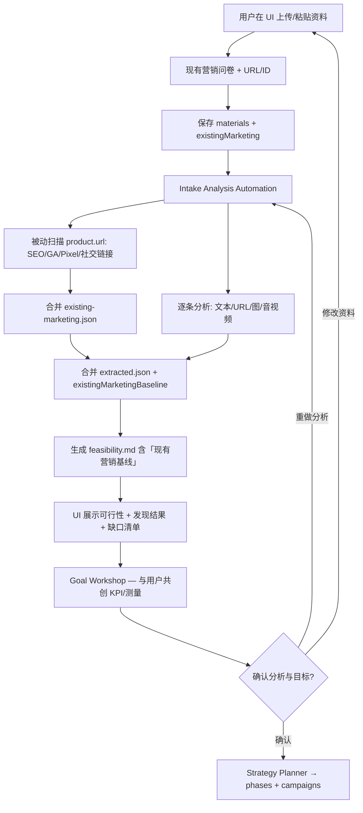

# Intake 阶段：多类型资料与可行性分析

定义用户在 **Intake 阶段** 如何提交各类资料，以及 Automation **如何分析** 并 **向用户反馈** 可行性营销策略与计划。

---

## 1. 目标

| 目标 | 说明 |
|------|------|
| **丰富输入** | 不仅填表单，还可上传/粘贴文本、网站、图片、音频、视频等 |
| **自动理解** | Automation 解析资料，提取产品卖点、受众、竞品、品牌调性 |
| **可行性分析** | 结合目标与渠道，给出「能不能做、怎么做、风险与周期」 |
| **反馈用户** | 在 UI 展示分析报告；用户确认或修改后再进入完整策略与脚本生成 |
| **现有营销盘点** | 了解用户 **已在进行** 的 SEO、Facebook、GA4、广告等；Automation 被动发现 + 向用户索取缺口 |
| **增量策略** | 在现有营销 **基础上** 规划 Continue / Fix / Add，而非一律从零开始 |

| **目标共创** | Analysis 后 **Goal Workshop** 与用户一起定 KPI、数字、测量源 — 见 [goal-workshop.md](./goal-workshop.md) |

Intake 阶段结束（进入 Planner 前）用户应看到：**理解 → 现有基线 → 可行性 → 共同确认的目标 → 再生成策略**。

> 详述：[existing-marketing-discovery.md](./existing-marketing-discovery.md) · [goal-workshop.md](./goal-workshop.md) · [marketing-integration-and-metrics.md](./marketing-integration-and-metrics.md)

---

## 2. 支持的资料类型

| 类型 | `type` | 来源 | 分析方式（Automation） |
|------|--------|------|------------------------|
| 纯文本 | `text` | 粘贴、上传 `.txt/.md` | LLM 结构化提取 |
| 网站 / URL | `url` | 用户填链接 | 抓取页面 → 正文/OG/meta → LLM |
| 图片 | `image` | 上传 `.jpg/.png/.webp` | Vision：Logo、截图、海报、UI |
| 视频 | `video` | 上传或 YouTube/Vimeo URL | 抽帧 + 可选转写 → LLM |
| 音频 | `audio` | 上传 `.mp3/.wav` 或语音 memo | 语音转文字 → LLM |
| 文档 | `document` | `.pdf/.docx/.pptx` | 文本提取 → LLM |
| 表格 | `spreadsheet` | `.csv/.xlsx` | 解析列 → 受众/定价线索 |

**限制（产品规则）：**

- 单文件大小上限（如 50MB 视频、10MB 图片）— UI 配置  
- 每项目材料数量上限（如 50 条）— 防滥用  
- 版权与合规：用户声明拥有使用权；禁止仅上传侵权内容  

---

## 3. 存储（每项目隔离）

```
tenants/{userId}/projects/{projectId}/
├── intake/
│   ├── active.json              # 结构化字段 + materials 索引
│   └── analysis/
│       ├── feasibility.md       # 可行性营销策略分析（给用户看）
│       ├── extracted.json       # 机器可读：卖点、受众、existingMarketingBaseline
│       ├── existing-marketing.json  # 现有营销盘点
│       └── material-notes/      # 每条资料的单独分析摘要
│           └── {materialId}.md
└── materials/                   # 二进制与原始文件（gitignore 大文件）
    └── {materialId}/
        ├── meta.json
        └── original.*           # 或 object storage URI
```

- **小文本 / URL 摘要** 可写入 `active.json`  
- **大文件** 存对象存储（S3 等），`active.json` 只存 `uri` + `materialId`  
- 材料 **不跨 projectId** 共享  

---

## 4. Intake 数据模型（materials）

`intake/active.json` 扩展字段：

```json
{
  "materials": {
    "items": [
      {
        "id": "mat_001",
        "type": "url",
        "title": "产品官网",
        "source": "url",
        "uri": "https://example.com",
        "mimeType": "text/html",
        "uploadedAt": "2026-06-14T10:00:00Z",
        "analysisStatus": "done",
        "analysisSummary": "B2C SaaS landing; primary CTA signup; tone friendly"
      },
      {
        "id": "mat_002",
        "type": "image",
        "title": "App 截图",
        "source": "upload",
        "uri": "materials/mat_002/original.png",
        "mimeType": "image/png",
        "uploadedAt": "2026-06-14T10:05:00Z",
        "analysisStatus": "pending",
        "analysisSummary": null
      }
    ],
    "analysisCompletedAt": null,
    "userConfirmedAnalysis": false
  }
}
```

模板文件：[../../intake/materials.schema.json](../../intake/materials.schema.json) · [../../intake/existing-marketing.schema.json](../../intake/existing-marketing.schema.json)

### 4.1 现有营销字段（`existingMarketing`）

Intake 表单除产品资料外，必须收集 **当前营销现状**：

| 字段 | 说明 |
|------|------|
| `hasActiveMarketing` | 是否已在跑营销 |
| `userSummary` | 自由描述现有活动 |
| `channelsUserDeclared[]` | 渠道 + status（active/paused/none）+ 用户提供的 URL/ID |
| `analytics` / `organicSocial` / `paidAds` / `seo` | 结构化已知信息 |
| `assetsNeededFromUser[]` | Analysis 后仍缺、需用户补的项 |

渠道清单与发现方式见 `runtime/existing-marketing-channels-catalog.json`。

---

## 5. 处理流程



### 5.1 阶段 A — 资料入库（同步）

- UI：拖拽上传、粘贴 URL、富文本框  
- API：写入 `materials.items[]`，大文件上传至 storage  
- 状态：`analysisStatus: pending`  

### 5.2 阶段 B — Automation 分析（异步）

**触发：** 用户点击「开始分析」或资料变更后自动（debounce）

**Automation 步骤：**

1. 读取 `intake/active.json`（含 `existingMarketing`）+ 各 `materials/{id}/`  
2. **现有营销盘点**（见 [existing-marketing-discovery.md](./existing-marketing-discovery.md)）：  
   - 对 `product.url` / 资料 URL **被动扫描**（title/meta、sitemap、GA4/GTM/Pixel 脚本、社交链接）  
   - 合并用户声明；上传资料中推断广告/报表信息  
   - 若有只读 API 凭证 → 拉 GA/GSC/Meta/Google Ads 摘要（可选）  
   - 写入 `intake/analysis/existing-marketing.json`，更新 `existingMarketing.discovery` 与 `assetsNeededFromUser`  
3. 按 type 调用能力：
   - `url` → fetch + readability  
   - `image` → vision 描述 OCR/品牌元素  
   - `video`/`audio` → 转写（若平台支持）  
   - `text`/`document` → 直接 LLM  
3. 写入 `intake/analysis/material-notes/{id}.md`  
4. 合并为 `intake/analysis/extracted.json`（含 **existingMarketingBaseline**：continue/fix/add）  
5. 生成 **`intake/analysis/feasibility.md`**（见 §6，**含 §2 现有营销基线**）  
6. 回填 `materials.items[].analysisSummary`；`analysisCompletedAt`  
7. 通知用户：「分析完成，请查看可行性报告与现有营销发现」  

### 5.3 阶段 C — 可行性反馈

UI 展示 `feasibility.md`，用户可补充资料或修改表单。

### 5.4 阶段 D — Goal Workshop（目标共创）

**触发：** `materials.analysisCompletedAt` 有值且用户已阅读 feasibility。

**目的：** 与 Analysis 分离 — **共同制定** 可测量目标（注册数、访问量、waitlist、MRR 等），非 Automation 替用户填数。

| 步骤 | 说明 |
|------|------|
| 展示 realistic 区间 | 来自 feasibility §4，供用户参考 |
| 选 primaryKpi + target + deadline | 写入 `goals.*` |
| 定测量源 | GA4 事件 / GSC / **product DB** / Metrics API / Stripe — 见 [product-data-connectors.md](./product-data-connectors.md) |
| baseline | 已知则填；unknown → Planner Phase 1 含 establish-baseline task |
| 确认 | `goals.userConfirmedGoals: true` + `goals.confirmedAt` |

**双门禁：** Planner 需 `userConfirmedAnalysis === true` **且** `userConfirmedGoals === true`。

详述：[goal-workshop.md](./goal-workshop.md)

### 5.5 阶段 E — 用户反馈与进入 Planner

| 操作 | 效果 |
|------|------|
| **确认可行性与目标** | 两者均为 true → 触发 Strategy Planner |
| **补充资料** | 回到上传；重新分析 |
| **修改目标** | 回到 Goal Workshop |
| **留言反馈** | 传入 Planner prompt |

**禁止：** 仅在 feasibility 确认、目标未确认时生成 execution campaigns。

---

## 6. 可行性分析输出（feasibility.md）

Automation 必须生成的章节（给用户看）：

### 6.1 我们理解到的信息

- 产品是什么、解决什么问题（引用自资料与表单）  
- 目标受众与地区（推断 + 用户填写对照）  
- 品牌调性、视觉风格（来自图片/视频/文案）  
- 已有资产：官网、社交、素材质量简评  

### 6.2 营销可行性评估

使用 **`runtime/marketing-methods-catalog.json`** + **`runtime/regions-catalog.json`**，对照 `audience.geographyRegions` 与 `methodsPreferred`：

| 维度 | 内容 |
|------|------|
| **按区域** | 每个 region 的推荐/避免手段与渠道（见 [channels-by-region.md](./channels-by-region.md)） |
| **按手段** | 各 methodId 可行性 H/M/L/Blocked + 是否可 Automation |
| **内容是否够用** | 现有素材能否支撑所选手段 |
| **预算与目标** | 含 `requiresPaidBudget` 手段是否可承受 |
| **合规** | region.compliance + 平台 ToS |

输出 `extracted.methodFeasibility[]`。集成说明：[integration-marketing-catalog.md](./integration-marketing-catalog.md)

### 6.3 建议营销方向（计划摘要）

- 推荐渠道优先级（Top 3）  
- 90 天 **阶段目标**（非完整 registry，是摘要）  
- 预计 **首条可衡量结果** 的时间范围  
- 建议 Automation **将执行的动作类型**（发帖、找群、建号等）  
- **不建议** 做的动作及原因  

### 6.4 待澄清问题（若有）

- 资料矛盾或缺失时列出问题清单  
- 用户可在 UI 回答 → 合并进 intake  

### 6.5 下一步

- 用户确认后 → 生成完整 `strategy/active-plan.md` + campaigns  
- 明确还需哪些凭证 / 人工步骤  

---

## 7. extracted.json（机器可读）

供 Strategy Planner 与 Execution 使用：

```json
{
  "productSummary": "",
  "valuePropositions": [],
  "audienceHints": [],
  "competitorsMentioned": [],
  "brandTone": "",
  "visualStyle": "",
  "contentAssetsAvailable": {
    "images": 3,
    "videos": 1,
    "hasLogo": true
  },
  "urlsCrawled": [],
  "quotesFromMaterials": [],
  "confidence": "high|medium|low",
  "gaps": ["missing pricing page", "no CTA on landing"]
}
```

Planner **必须** 同时读 `active.json`、`extracted.json`、`feasibility.md`。

---

## 8. UI 要求（Product）

| 模块 | 功能 |
|------|------|
| **资料库** | 列表：类型图标、标题、分析状态、摘要预览 |
| **上传区** | 多文件、URL 输入、粘贴长文本 |
| **分析进度** | pending / processing / done / failed |
| **可行性报告页** | 渲染 feasibility.md；**现有营销发现卡片**；高亮 Continue/Fix/Add |
| **缺口补全** | `assetsNeededFromUser` → 补 GA 授权、Facebook 主页 URL 等 |
| **Goal Workshop** | 选 KPI、target、deadline、测量源；确认 `userConfirmedGoals` |
| **产品数据（可选）** | 是否接 DB/API、kpiMappings — 见 product-data-connectors |
| **确认 CTA** | 可行性 + **目标** 均确认后 → Strategy Planner |

---

## 9. Automation 分工

| Automation | 职责 |
|------------|------|
| **Intake / Onboarding** | 收表单 + 收材料索引；触发分析 |
| **Intake Analysis** | 多模态分析 + **站点被动扫描** + existing-marketing.json → feasibility 基线章节 |
| **Strategy Planner** | 用户确认 feasibility **且** goals 后 → active-plan + phases + campaigns |

独立 prefill 建议：`05-intake-analysis.json`（v0.2）

---

## 10. 隐私与安全

- 材料默认 **私有**，仅本项目 Automation 可读  
- 传输 HTTPS；存储加密  
- 用户可删除单条 material → 级联删除 analysis notes  
- LLM 调用：不训练、按项目 tenant 隔离（合约级要求）  

---

## 11. 相关文档

- [PRD.md](./PRD.md) §5.1、§5.2  
- [user-journey.md](./user-journey.md) — Intake 阶段  
- [goal-workshop.md](./goal-workshop.md) — 分析后目标共创  
- [marketing-integration-and-metrics.md](./marketing-integration-and-metrics.md) — 手段集成与三层监控  
- [product-data-connectors.md](./product-data-connectors.md) — 产品 DB/API 只读  
- [existing-marketing-discovery.md](./existing-marketing-discovery.md) — 现有 SEO/GA/Facebook 等盘点  
- [automation-commander.md](./automation-commander.md) — 确认后进入 Phase Loop（全用户 · 全项目）  
- [features.md](./features.md) — F1.4 多模态资料  
- [../user-intake-guide.md](../user-intake-guide.md)
