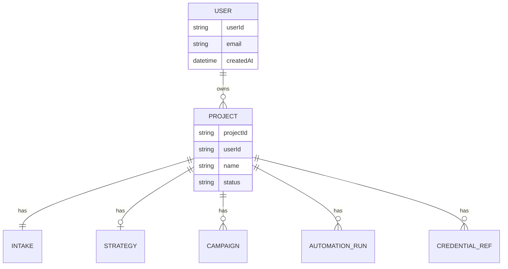

# 多租户与项目隔离模型

本文档定义 Marketing Autopilot **作为面向客户的产品**时的核心数据模型。  
当前 GitHub 仓库中的 `intake/`、`strategy/` 等路径是 **单个项目的模板结构**，不是客户的使用方式。

---

## 1. 核心原则

| 原则 | 说明 |
|------|------|
| **UI 优先** | 客户通过 Web/App 界面输入需求，不要求 clone 仓库或跑 npm |
| **用户隔离** | 每个注册用户的数据、凭证引用、执行记录互不可见 |
| **项目隔离** | 同一用户可有多个项目；每个项目有独立的 intake、策略、脚本、ops |
| **Automation 读项目上下文** | Cursor Automation 按 `userId` + `projectId` 读写，而非共享全局目录 |
| **Automation 总指挥** | **每个 Project** 分阶段写代码、run-phase、更新 progress；用户只看进度与 pending-human |
| **活动可审计** | 从注册起逐步写入 activity log；需用户输入时 obligation + 定期通知 |
| **脚本独立** | 每个项目的 `campaigns/`、`phases.json`、`registry.json` 彼此独立 |

---

## 2. 实体关系



```
User（用户）
  └── Project A（项目：例如「SparkConnect 获客」）
  │     ├── intake/
  │     ├── strategy/
  │     ├── runtime/ + campaigns/
  │     └── ops/
  └── Project B（项目：例如「另一款 SaaS」）
        ├── intake/          ← 与 A 完全独立
        ├── strategy/
        └── ...
```

**项目之间不共享：** intake、策略文档、营销脚本、执行日志、凭证命名空间、Automation 调度参数。

---

## 3. 逻辑目录结构（每个 Project 一份）

平台为每个 `projectId`  provisioning 独立工作区（对象存储 + Git 子仓库或前缀路径均可）：

```
tenants/{userId}/
├── notifications.json          # 用户级：渠道、语言、quiet hours
├── activity/
│   └── events.jsonl            # 注册、登录、建 Project 等
└── notifications/
    └── delivery.jsonl          # 发出的邮件/Push 记录
tenants/{userId}/projects/{projectId}/
├── meta.json                 # 项目名、创建时间、状态、关联 repo（若有）
├── intake/
│   └── active.json           # 来自 UI 表单 + materials 索引
├── intake/analysis/
│   ├── feasibility.md        # 可行性营销策略（反馈用户）
│   ├── extracted.json
│   └── existing-marketing.json  # 现有营销盘点
├── materials/                # 上传的文件（大文件 gitignore）
│   └── {materialId}/
├── strategy/
│   └── active-plan.md        # Automation 生成
├── runtime/
│   ├── orchestrator/
│   │   ├── phases.json         # 本项目阶段链（Planner 生成，每项目不同）
│   │   ├── registry.json       # 仅本项目的 task
│   │   └── plan.json
│   ├── user-inputs.json        # 用户可选输入（Automation 读；用户仅在 pending-human 时填）
│   ├── notifications.json      # 项目级通知覆盖（可选）
│   └── credentials/
│       └── refs.json
├── campaigns/
│   └── {slug}/                 # Automation 生成的 run.mjs 等
├── accounts/
│   ├── registry.json         # FB / IG / X 等账户状态
│   └── {channel}/{id}/session/  # gitignore
├── ops/
│   ├── progress.json           # ★ 用户仪表盘唯一真相源（每项目）
│   ├── pending-human.json      # ★ 用户唯一「待办」来源（含 notification 催促字段）
│   ├── activity/
│   │   └── events.jsonl        # ★ 本项目用户+Automation 交互日志
│   ├── actions/              # 结构化动作日志 jsonl
│   ├── daily/
│   ├── weekly/
│   └── state/metrics.json
└── automations/
    └── bindings.json         # 本项目绑定的 Cursor Automation run 配置
```

模板来源：本仓库根目录的 `intake/template.json`、`strategy/template.md` 等 — **复制到每个新项目**，而非所有客户共用一个 `active.json`。

---

## 4. 客户界面（Product UI）

### 4.1 客户看到什么

| 页面 | 功能 |
|------|------|
| **注册 / 登录** | 创建账号，进入控制台 |
| **项目列表** | 查看、新建、归档多个项目 |
| **项目 · 需求与资料** | 分步表单 + 上传文本/URL/图/音视频/PDF |
| **项目 · 可行性报告** | 展示 `feasibility.md`：渠道可行性、计划摘要；用户确认后继续 |
| **项目 · 对话补全** | 缺项时与 Agent 对话（对接 Onboarding Automation） |
| **项目 · 完整策略** | 确认分析后展示 `active-plan.md`：做什么、多久、KPI |
| **项目 · 凭证** | 按渠道引导填写 AWS / Stripe / Telegram 等（存入 Vault，UI 不显示明文） |
| **项目 · 运行状态** | 读 **本项目** `ops/progress.json`（阶段进度、task 摘要、pendingUserActions） |
| **项目 · 待办收件箱** | 合并 pending-human + pendingUserActions + 缺凭证；**Snooze** |
| **项目 · 活动时间线** | 读 `ops/activity/events.jsonl`（Intake、确认、补信息等） |
| **项目 · 设置** | 运行环境偏好、启用/暂停 Execution |

### 4.2 客户不需要做什么

- ❌ `git clone marketing-autopilot`
- ❌ `npm install`（除非自选 local worker 高级模式）
- ❌ 手动编辑 JSON 路径
- ❌ 与其他客户共用同一仓库目录

---

## 5. 平台 ↔ Automation 协作

```
┌─────────────────────────────────────────────────────────────┐
│  Product UI（客户）                                          │
│  表单 / 对话 → API → 写入 tenants/.../projects/{id}/intake   │
└────────────────────────────┬────────────────────────────────┘
                             │ webhook / 队列
                             ▼
┌─────────────────────────────────────────────────────────────┐
│  Cursor Automations（按 projectId 参数化）                   │
│  Onboarding → Strategy → Execution → Weekly Review          │
│  gitConfig.repo = 该项目专属 repo 或 platform 内 project 分支  │
└────────────────────────────┬────────────────────────────────┘
                             │
                             ▼
┌─────────────────────────────────────────────────────────────┐
│  项目工作区（隔离存储）                                       │
│  仅读写 tenants/{userId}/projects/{projectId}/               │
└─────────────────────────────────────────────────────────────┘
```

**Automation prompt 必须携带上下文：**

```
userId: usr_xxx
projectId: prj_yyy
workspaceRoot: tenants/usr_xxx/projects/prj_yyy/
```

禁止 Agent 读写其他 userId / projectId 下的路径。

---

## 6. 凭证隔离

| 层级 | 规则 |
|------|------|
| 用户级 | 账号、账单、登录会话 |
| 项目级 | 所有营销 API Key、Telegram session、Stripe key |
| 存储 | 平台 Secret Vault；`credentials/refs.json` 只存 key 名称与 vault id |
| Cursor | Automation Secrets 使用命名空间：`MA_{projectId}_TELEGRAM_SESSION` |

项目 A 的 Telegram session **不得**被项目 B 的 Execution 使用。

---

## 7. 执行隔离

| 维度 | 隔离方式 |
|------|----------|
| registry.json | 每项目独立 task 列表 |
| phases.json | 每项目独立阶段链（Planner 按 intake 生成） |
| campaigns/ | 每项目独立脚本目录（Automation 生成 run.mjs） |
| ops/progress.json | 每项目独立；UI 只读本项目 |
| cron / Automation | 每项目独立 schedule 或 run 带 projectId |
| EC2 / Worker | 推荐每项目独立 worker 或容器；至少环境变量带 projectId |
| metrics / ops | 仅写入本项目 ops/ |

---

## 8. 本仓库的角色（重新定位）

| 角色 | 说明 |
|------|------|
| **平台工程仓库** | 产品文档、Automation 模板、orchestrator 参考实现 |
| **项目模板** | `intake/template.json` 等供 provisioning 复制 |
| **非客户入口** | 客户使用 **Product UI**，不是本 README 的 Quick start |

开发者 clone 本仓库是为了：**实现平台 UI、API、租户存储与 Automation 集成**。

---

## 9. 与 v0.1 框架的关系

v0.1 已交付的是 **单项目模板 + Automation 预填稿**（技术骨架）。  
下一版（见 [roadmap.md](./roadmap.md)）补齐：

1. Product UI + 用户/项目 API  
2. 按 projectId provisioning 工作区  
3. 参数化 Automation（不再硬编码单一 repo 根路径）

---

## 10. 相关文档

- [user-journey.md](./user-journey.md) — 以客户 UI 为主的旅程  
- [PRD.md](./PRD.md) §5 — 功能需求（含 UI 与多项目）  
- [features.md](./features.md) — F0 平台与多租户验收标准
