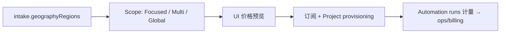

# 定价与商业化

Marketing Autopilot 是 **面向全球** 的 SaaS：同一套产品、同一套定价逻辑，服务在任何国家注册、向 **任意目标市场** 做营销的客户。  
不按「客户所在国」分价；按 **订阅档位、活跃 Project、Automation 用量、以及该 Project 的营销地理范围** 计费。

> 区域营销规则见 [channels-by-region.md](./channels-by-region.md)、[regions-catalog.json](../../runtime/regions-catalog.json)。  
> Intake 字段：`audience.geographyRegions[]`

---

## 1. 定价原则

| 原则 | 说明 |
|------|------|
| **全球统一** | 官网、Product UI、账单均以 **USD** 标价；支付支持国际卡（Stripe 等），后续可加本地支付方式，**不** 按客户注册地拆产品线 |
| **卖执行，不卖诊断** | Free 给 Intake + 可行性 + **现有营销盘点**；Paid 给 Automation 总指挥（phases / run-phase / campaigns） |
| **范围影响成本** | 客户要打的 **目标市场越多**，Planner 与 Execution 的复杂度越高（渠道、合规、语言、任务数）→ 纳入定价 |
| **Project 是隔离单位** | 每个 `projectId` 独立 intake、策略、runs；多产品/多品牌 = 多 Project |
| **用量可预期** | 套餐含 **included automation runs**；超出按量或暂停并提示升级 |
| **与广告 spend 解耦** | 平台费 **不** 按 Meta/Google 广告费抽成；客户广告预算自行在广告平台支付 |

---

## 2. 计费维度（四维）

```
月费 ≈ 基础订阅（Plan）
     × 营销地理范围系数（Scope）
     + 额外 Project
     + 超额 Automation Runs
     + 可选 Channel Pack 加购
```

### 2.1 Plan — 基础订阅档位

| 档位 | 月费 (USD) | 含活跃 Project | 含 included runs/月 | 核心能力 |
|------|------------|----------------|---------------------|----------|
| **Free** | $0 | 1 | 0（仅 Analysis） | Intake、资料、可行性、现有营销被动扫描、策略摘要预览 |
| **Starter** | $69 | 1 | 300 | 完整 Automation 总指挥；Weekly Review；基础 SEO/内容 campaigns |
| **Growth** | $199 | 3 | 1,500 | 多 Project；GA/GSC/Meta 只读连接；更高 cron 频率 |
| **Scale** | $499 | 10 | 6,000 | 优先队列；多 Worker 槽位；高级 Pack 折扣 |
| **Enterprise** | 定制 | 合同约定 | 合同约定 | SSO、SLA、Dedicated Worker、自定义合规 |

年付：标价的 **85%**（约 15% 折扣）。

额外 Project：**$39/月/个**（Starter）；Growth 及以上 **$29/月/个**。

### 2.2 Scope — 营销地理范围（按 Project 计）

来自 Intake **`audience.geographyRegions[]`**（与 `runtime/regions-catalog.json` 的 region key 对齐：US、EU、SEA、JP、MENA、LATAM、CN、GLOBAL_EN 等）。

**定义的是「客户要营销到哪里」**，不是「客户公司注册在哪里」。

| Scope 等级 | 条件（每 Project） | 月费系数 | 产品含义 |
|------------|-------------------|----------|----------|
| **Focused** | 仅 **1** 个 region | ×1.0 | 单市场打法（如仅 US 或仅 EU） |
| **Multi-market** | **2–3** 个 regions | ×1.35 | 多区域策略、多合规集、多语言内容 |
| **Global** | **≥4** 个 regions，或 intake 标明全球/multiple continents | ×1.75 | 全 catalog 组合、最高 Planner/Execution 复杂度 |

**示例：**

- 仅卖美国：`geographyRegions: ["US"]` → Focused，Starter = $69  
- 美国 + 欧盟：`["US", "EU"]` → Multi-market，Starter ≈ $69 × 1.35 ≈ **$93**  
- 美欧东南亚日：`["US","EU","SEA","JP"]` → Global，Starter ≈ $69 × 1.75 ≈ **$121**

Scope 在 **创建/更新 Intake 时** 由 UI 展示并写入账单预览；中途扩大范围 → 下一账期按新 Scope 计费（或 prorate）。

**为何合理：** 区域越多 → feasibility 矩阵越大、channels-by-region 约束越多、campaigns 与内容语言越多、Automation runs 消耗越高。

### 2.3 Runs — Automation 用量

可计费 run 类型（与 `ops/` 对齐）：

| Run 类型 | 说明 |
|----------|------|
| `analysis_run` | Intake Analysis（含 existing-marketing 站点扫描） |
| `planner_run` | Strategy Planner（phases + campaigns 生成） |
| `phase_run` | `run-phase` 整阶段 |
| `task_run` | 单 registry task（可选细粒度） |
| `review_run` | Weekly Review |

套餐内 **included runs** 见 §2.1。超出部分：

- Starter / Growth：**$8 / 100 runs**
- Scale：**$5 / 100 runs**
- 达到 100% 配额：邮件通知；120%：可配置 **软暂停** outbound，保留 intake/仪表盘只读

Free 层：每月 **2 次** `analysis_run`（含被动扫描），**0** execution runs。

### 2.4 Channel Pack — 可选加购（按 Project / 月）

重执行、重 Worker、重合规的渠道单独加购，与 Scope 独立：

| Pack | USD/月/Project | 说明 |
|------|----------------|------|
| **Meta organic + ads read** | $49 | FB/IG 主页、Pixel、广告只读 insights + 发帖类 campaigns |
| **Search & SEO depth** | $39 | GSC 连接、深度 SEO audit、内容 pipeline |
| **Messaging (Telegram / email automation)** | $49 | DM、群、邮件序列（受 region 可用性约束） |
| **Local Worker slot** | $79 | Playwright 持久会话；browser 类 action |

Pack 是否可用仍受 **该 Project 的 geographyRegions** 限制（例如 catalog 中某 channel 在某 region 为 avoid 时不售卖对应 Pack）。

---

## 3. 与 Intake / 产品流程的衔接



| 环节 | 行为 |
|------|------|
| **Onboarding UI** | 选择目标市场（region 多选）→ 实时显示 Scope 等级与 **预估月费** |
| **Feasibility** | 仅展示 **该 Scope 下** 可行的 methods/channels（已有 catalog 逻辑） |
| **升级 Scope** | 用户增加 region → 提示系数变化；Planner 重跑或增量 phase |
| **降级 Scope** | 下账期生效；已生成 campaigns 不自动删除，但新 runs 受新 Scope 配额约束 |

平台 API（v1.0）：`GET /api/billing/quote?plan=starter&regions=US,EU&projects=1`

---

## 4. Free vs Paid 边界（全球一致）

| 能力 | Free | Paid |
|------|------|------|
| Intake + materials | ✅ | ✅ |
| 现有营销被动扫描 | ✅ | ✅ |
| feasibility + 现有基线 | ✅ | ✅ |
| 完整 active-plan + phases | 摘要/水印预览 | ✅ |
| campaigns + run-phase | ❌ | ✅ |
| Vault / GA·Meta API | ❌ | ✅（按 Plan） |
| Weekly Review 自动执行 | ❌ | ✅ |
| 多 Project | ❌（1 个） | 按 Plan |

---

## 5. Enterprise 与 Agency

面向多 Project、多成员的团队：

- **Seat**：$25–35/月/成员（查看 progress + 批准 outbound + Vault 管理）
- **最低消费**：通常 **$800–2,000/月** 起
- **White-label / API**：合同项
- **Dedicated Worker**：区域可选（客户选 Worker 部署 region 以配合 **目标市场的** 登录风控，非「国内版/海外版」产品）

---

## 6. 版本与 rollout

| 版本 | 商业化 |
|------|--------|
| v0.2 | Beta：**全 Free**；Waitlist；账单 UI 仅 **Quote 预览**（不扣款） |
| v0.3 | Stripe 上线：Free + Starter + Growth；Scope 系数生效 |
| v1.0 | Scale、Enterprise、Pack 市场、runs 仪表盘、Seat |

---

## 7. 验收标准（产品）

见 [features.md](./features.md) § F11。

---

## 8. 相关文档

- [PRD.md](./PRD.md) §2、§6  
- [roadmap.md](./roadmap.md) v1.0  
- [integration-marketing-catalog.md](./integration-marketing-catalog.md) — region 与 catalog  
- [multi-tenant-model.md](./multi-tenant-model.md) — Project 隔离
