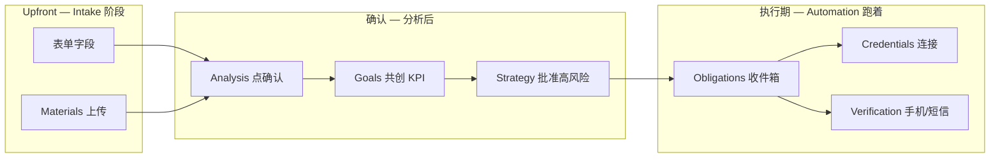

# 产品 UI 样式与设计规范

Marketing Autopilot **客户端（Product UI）** 的视觉、布局、组件与文案规范。  
实现栈见 [implementation.md](./implementation.md) §3、§8（Next.js App Router + `platform/web/`）。

> 产品心智：[automation-commander.md](./automation-commander.md) · 用户旅程：[user-journey.md](./user-journey.md)  
> Obligations 定义：[user-activity-and-notifications.md](./user-activity-and-notifications.md) §3  
> 品牌参考：`projects/marketing-autopilot-launch/assets/og.svg`

---

## 1. 设计目标

| 目标 | 说明 |
|------|------|
| **指挥台，非任务板** | 用户 **观察** Automation 进度；仅在阻塞时 **解除** obligation |
| **可信、合规** | 高风险动作（建号、冷 DM）视觉上「重」；凭证永不明文 |
| **全球 SaaS** | 默认英文 UI；i18n 预留；区域/渠道用 catalog **label** |
| **开发者友好** | 受众含独立开发者、小团队；风格接近 Linear / Vercel，非炫彩 martech |
| **移动可处理阻塞** | 验证、obligation deep link 在手机上必须好用 |

---

## 2. 核心心智模型

```
┌─────────────────────────────────────────────────────────────┐
│  Automation 总指挥（后台）                                    │
│  定阶段 · 写代码 · run-phase · 汇报                          │
└────────────────────────────┬────────────────────────────────┘
                             │
         ┌───────────────────┼───────────────────┐
         ▼                   ▼                   ▼
   Dashboard            Activity           Obligations
   「整体进度/KPI」      「发生了什么」      「卡在哪 · 请你做什么」
```

| 页面 | 回答的问题 | 数据真相源 |
|------|------------|------------|
| **Dashboard** | 现在在哪个 phase？KPI 怎样？ | `ops/progress.json` · `ops/state/metrics.json` · goals |
| **Activity** | Automation/我做过什么？ | `ops/activity/events.jsonl` |
| **Obligations** | 什么在等我？ | open obligations 合并视图（§7） |

**Invariant（样式层也必须遵守）：**

- ❌ 不得出现「本周营销 todo 清单」checkbox 列表  
- ❌ 不得暴露 Vault 明文、session 路径、registry 原始 JSON 编辑  
- ✅ pending-human / 凭证 / 验证 / 批准 → **Obligations** 或 Dashboard 顶部 banner  

---

## 3. 信息架构（IA）

### 3.1 App Shell

```
┌──────────────────────────────────────────────────────────────┐
│ [Logo]  Project ▼   SparkConnect Launch          🔔 (2)  [Avatar] │
├────────────┬─────────────────────────────────────────────────┤
│ Overview   │                                                 │
│ Intake     │              Main content                       │
│ Analysis   │                                                 │
│ Goals      │                                                 │
│ Strategy   │                                                 │
│ Activity   │                                                 │
│ Obligations│                                                 │
│ Credentials│                                                 │
│ Settings   │                                                 │
└────────────┴─────────────────────────────────────────────────┘
```

| 区域 | 规范 |
|------|------|
| **顶栏** | 项目切换 dropdown；Obligations 未读 badge；用户菜单 |
| **侧栏** | 项目内 nav；当前路由高亮；Onboarding 未完成时 Goals 前步骤可标 ⚠ |
| **主内容** | max-width `1200px`（报告页可 `960px` 阅读宽） |
| **默认 landing** | `/projects/:id` → **Overview（Dashboard）** |

### 3.2 路由与 nav 标签

| 路由 | Nav 标签（en） | 中文（i18n） |
|------|----------------|--------------|
| `/projects` | Projects | 项目 |
| `/projects/:id` | Overview | 概览 |
| `/projects/:id/intake` | Intake | 需求与资料 |
| `/projects/:id/analysis` | Analysis | 可行性分析 |
| `/projects/:id/goals` | Goals | 目标共创 |
| `/projects/:id/strategy` | Strategy | 策略 |
| `/projects/:id/activity` | Activity | 活动 |
| `/projects/:id/obligations` | Obligations | 待处理 |
| `/projects/:id/credentials` | Credentials | 凭证 |
| `/projects/:id/settings` | Settings | 设置 |
| `/register`, `/login` | — | 无侧栏 |

### 3.3 Onboarding Stepper（项目未完成双门禁时）

顶栏下方可选 **水平 Stepper**（不替代侧栏）：

```
Intake → Analysis → Goals → Strategy → Running
  ●        ○         ○        ○          ○
```

- 已完成：✓ + 可点击回看  
- 当前：accent 高亮  
- 锁定：Goals 前未确认 Analysis 则 Goals 灰显 + tooltip  

---

## 4. 视觉语言（Design Tokens）

**默认主题：Control Tower Dark**（与 dogfood OG 一致）。v0.2 仅 dark；v0.3+ 可加 light toggle。

### 4.1 色彩

| Token | Hex | 用途 |
|-------|-----|------|
| `bg-base` | `#0f172a` | 页面背景（slate-900） |
| `bg-elevated` | `#1e293b` | 卡片、侧栏（slate-800） |
| `bg-muted` | `#334155` | 输入框底、次要块（slate-700） |
| `border-default` | `#475569` | 分割线（slate-600） |
| `text-primary` | `#f8fafc` | 标题、正文（slate-50） |
| `text-secondary` | `#94a3b8` | 说明、meta（slate-400） |
| `text-muted` | `#64748b` | 占位、禁用（slate-500） |
| `accent` | `#22d3ee` | 链接、当前 phase、Automation 强调（cyan-400） |
| `accent-muted` | `#0891b2` | accent hover 底（cyan-600） |
| `success` | `#4ade80` | phase 完成、已连接（green-400） |
| `warning` | `#fbbf24` | obligation、待确认（amber-400） |
| `danger` | `#f87171` | 验证失败、restricted（red-400） |
| `risk-high` | `#fb923c` | 批准门、account.create（orange-400） |

**渐变（仅 marketing 对外页 / OG，App 内少用）：**

`linear-gradient(135deg, #0f172a 0%, #1e3a5f 100%)`

### 4.2 字体

| Token | 值 |
|-------|-----|
| `font-sans` | `Inter`, `Geist Sans`, system-ui, sans-serif |
| `font-mono` | `Geist Mono`, `ui-monospace`, monospace（ID、measurement ID） |
| `text-xs` | 12px / line 16 |
| `text-sm` | 14px / line 20 |
| `text-base` | 16px / line 24 |
| `text-lg` | 18px / line 28 |
| `text-xl` | 20px / line 28 |
| `text-2xl` | 24px / line 32 |
| `text-kpi` | 36px / line 40 · `font-semibold` · `tabular-nums` |

### 4.3 间距与圆角

| Token | 值 |
|-------|-----|
| `space-1` … `space-8` | 4 / 8 / 12 / 16 / 24 / 32 / 40 / 48 px |
| `radius-sm` | 6px |
| `radius-md` | 10px（按钮、输入） |
| `radius-lg` | 12px（卡片） |
| `radius-xl` | 16px（modal、大 panel） |

### 4.4 阴影与边框

- 卡片：`1px border border-default` + 可选 `shadow-sm`（`0 1px 2px rgba(0,0,0,.4)`）  
- Modal：`shadow-xl` + `bg-elevated`  
- 不用 heavy glassmorphism  

### 4.5 图标

- 库：**Lucide**（与 shadcn 默认一致）  
- `actor=automation`：Bot / Zap  
- `actor=user`：User  
- Obligation：AlertCircle / Mail  
- Phase 完成：CheckCircle2  

### 4.6 动效

| 场景 | 时长 | 曲线 |
|------|------|------|
| hover / focus | 150ms | ease |
| stepper / tab | 200ms | ease-out |
| modal | 200ms | ease-out |
| skeleton pulse | 1.5s | linear infinite |

禁止：全屏 parallax、自动轮播 hero、闪烁 CTA。

---

## 5. 全局组件

### 5.1 按钮

| 变体 | 用途 |
|------|------|
| **Primary** | 主 CTA：Confirm analysis、Connect GA、Resolve obligation |
| **Secondary** | 取消、Back |
| **Ghost** | 侧栏、表格行内 |
| **Destructive** | 归档项目、撤销批准（少见） |
| **Risk** | 批准 account.create：orange 边框 + 二次 modal |

Loading：spinner + disabled；文案变「Connecting…」。

### 5.2 表单

- Label 上置；必填 `*`；helper text `text-secondary text-sm`  
- 错误：`danger` 文案 + 输入框 border-danger  
- Section 用 **Card** 分组（Product / Audience / Existing marketing）  
- 自动保存：debounce 1s → toast「Saved」+ activity（非整页刷新）  

### 5.3 Toast / Banner

| 类型 | 用途 |
|------|------|
| Toast success | 保存、凭证已连接 |
| Banner warning | Dashboard 顶：「2 obligations need attention → Inbox」 |
| Banner info | Analysis 运行中 |

### 5.4 空状态 EmptyState

```
[illustration optional]
No open obligations
Automation is running — check Activity for latest work.
[View Activity]
```

Automation 分析中：skeleton + 「Analyzing your site…」

---

## 6. 模式组件（Pattern Components）

实现参考：`platform/web/components/`（待建）。

| 组件 | 职责 | 主要 props / 数据 |
|------|------|-------------------|
| `PhasePipeline` | 横向 phase 步骤 | `phases.json`, `currentPhase` |
| `KpiHero` | L3 目标大数字 | `goals.*`, metrics `goalProgress` |
| `MetricsStrip` | L2 折叠条 | `metrics.json sources` |
| `ActivityFeedItem` | 时间线一行 | `events.jsonl` row |
| `ActivityFeed` | 筛选 + 分页 | `category`, `actor` |
| `ObligationCard` | 单条阻塞 | `obligationId`, snooze, CTA |
| `ObligationInbox` | 列表 + 排序 | priority 规则 §7.2 |
| `ApprovalGate` | 高风险 toggle + modal | `actionsApproved.*` |
| `CatalogMethodPicker` | 手段多选 + region 推荐 | catalog API |
| `CatalogChannelPicker` | 渠道多选 | action-catalog channels |
| `ReportProse` | feasibility / strategy MD | sanitized markdown |
| `ContinueFixAddTags` | 三色 tag | existing-marketing baseline |
| `CredentialChannelCard` | 连接状态 | Vault status only |
| `IdentityGatePanel` | 域名/邮箱/测量 | [greenfield-identity-gate.md](./greenfield-identity-gate.md) |
| `ProjectSwitcher` | 顶栏 dropdown | projects list |
| `OnboardingStepper` | 顶栏下步骤 | gate flags |

---

## 7. Obligations 收件箱（重点）

### 7.1 定义

**Obligations** = 合并所有 **Open user obligation** 的 UI 视图（非营销 todo）。

来源：[user-activity-and-notifications.md](./user-activity-and-notifications.md) §3：

- Intake 缺必填  
- Feasibility / Goals 未确认  
- `pendingUserActions`  
- `pending-human.json` open  
- 阻塞 phase 的缺凭证  
- 高风险 `approval` 待批  
- `verification_required`  

### 7.2 列表排序（优先级从高到低）

1. `verification_required`  
2. 阻塞当前 `run-phase` 的 credential  
3. `pendingUserActions`  
4. `goals_unconfirmed` / `feasibility_unconfirmed`  
5. Intake 缺项  
6. `account_create_approval`  
7. Identity Gate（DNS pending 等）  

### 7.3 ObligationCard 样式

```
┌─ left accent bar (warning | danger | risk-high) ─────────────┐
│ [icon]  Title (text-base font-medium)                         │
│         Reason one line (text-secondary text-sm)             │
│         Meta: Created 2d ago · Reminded 1x                   │
│         [Primary CTA]  [Snooze ▼]  [Dismiss if N/A]          │
└──────────────────────────────────────────────────────────────┘
```

- **禁止** checkbox「标记完成」— 完成由 **用户提交数据/API resolve** 自动关闭  
- Snooze：24h / 72h / 7d dropdown  
- CTA 文案示例：「Complete verification」「Connect GA4」「Confirm report」  

### 7.4 与顶栏 badge

`bell` badge = open count；0 时不显示。点击 → `/obligations`。

---

## 8. 分屏规范

### 8.1 Auth（`/login`, `/register`）

- 居中 card `max-w-md`；Logo + 一句 value prop  
- 无侧栏；背景 `bg-base` 或 subtle gradient  
- OAuth 按钮 secondary 排列  

**Value prop（en）：**  
「Provide info. Watch Automation plan, code, and run your marketing.」

### 8.2 Projects（`/projects`）

- 卡片网格：项目名、phase 摘要、last activity、obligation badge  
- 「New project」primary card  

### 8.3 Overview / Dashboard（`/projects/:id`）

**布局（自上而下）：**

1. **Optional banner** — open obligations > 0  
2. **PhasePipeline** — 全宽  
3. **Grid 2 col（md+）** — 左 `KpiHero`，右 `MetricsStrip` 摘要  
4. **Recent Activity** — 最多 5 条 + link to Activity  
5. **Phase tasks 摘要** — 来自 progress（**只读** status + summary，无 checkbox）  

Task 行样式：

```
✓  Waitlist landing generated     Completed · 2h ago
●  GA4 baseline collection       Running
○  SEO audit                     Queued
```

### 8.4 Intake（`/intake`）

Intake **不是** 执行进度页；也 **不是** 最终 KPI 确认页（数字目标在 **Goals**）。  
完整字段映射 `intake/template.json` — 人类说明 [user-intake-guide.md](../user-intake-guide.md)。

#### 8.4.1 表单分区（建议 9 张卡片 + 侧栏进度）

| # | UI Section | `active.json` 字段 | 用户填什么 |
|---|------------|-------------------|------------|
| 1 | **Product** | `product.*` | 名称、URL、一句话、**完整描述**、定价模式 |
| 2 | **Target market** | `audience.*` | ICP、**目标国家/区域**、语言、**痛点** |
| 3 | **Promotion intent** | `marketing.*`（非 goals 数字） | 偏好手段/渠道、avoid、**月预算**、品牌调性、合规说明 |
| 4 | **Existing marketing** | `existingMarketing.*` | 是否已在跑、渠道状态、GA/FB/广告 ID、自由描述 |
| 5 | **Brand identity** | `identity.*` | 域名、期望品牌邮箱（Identity Gate 前置） |
| 6 | **Account strategy** | `marketing.accountStrategy` | 用已有社媒 vs 允许自动创建（需批准） |
| 7 | **Product data**（可折叠） | `productData.*` | 是否有产品 DB / Metrics API（L3 KPI） |
| 8 | **Materials** | `materials.items[]` | 上传 URL/图/视频/PDF/粘贴长文 |
| 9 | **Runtime** | `runtime.preferred` | Cloud / hybrid / local worker 偏好 |

**Goals 初填（可选）：** Intake 可放「推广意向」短文或 rough KPI 想法；**正式 target/deadline/measurement** 仅在 **Goals** 页 `userConfirmedGoals` 锁定。

**侧栏 Intake 进度条：** 必填 completion %（product.name + url + audience.primary + geographyRegions + hasActiveMarketing）。

Region 选中后：推荐 methods **accent 边框**；avoid **opacity-50 + tooltip**。

Footer sticky：**Save**（debounce 自动保存 + toast）· **Request analysis**（primary，最小必填满足后启用）。

可选 v0.3：**右侧 Agent 面板** 对话补全缺项（对接 Onboarding Automation）— 非 v0.2 默认。

#### 8.4.2 Intake 里没有的内容（易混淆）

| 用户关心 | 实际页面 | 数据 |
|----------|----------|------|
| **宣传执行进度** | **Overview (Dashboard)** | `ops/progress.json` |
| **Automation 做了什么** | **Activity** | `ops/activity/events.jsonl` |
| **现在需要你做什么** | **Obligations** | open obligations |
| **确认推广数字目标** | **Goals** | `goals.userConfirmedGoals` |
| **确认可行性** | **Analysis** | `materials.userConfirmedAnalysis` |
| **填 API 密钥** | **Credentials** | Vault |
| **执行中临时字段**（Waitlist URL 等） | **Obligations** → modal 写 `runtime/user-inputs.json` | `pendingUserActions` |

#### 8.4.3 用户如何提供信息（全产品）



| 提供方式 | 场景 | UI 入口 | 写入 |
|----------|------|---------|------|
| 表单字段 | 产品/市场/渠道偏好 | Intake 各 card | `intake/active.json` |
| 上传/URL | 宣传册、截图、demo 视频 | Materials dropzone | `materials/` + items[] |
| 点击确认 | 可行性、KPI | Analysis / Goals 底栏 | `userConfirmed*` flags |
| 连接 OAuth/密钥 | GA、AWS、Meta | Credentials / Obligation CTA | Vault + refs |
| 结构化补字段 | Waitlist 表单 URL、embed | Obligation 卡片 → modal | `user-inputs.json` + resolve obligation |
| 手机/浏览器 | FB 短信验证 | Obligation + 外链说明 | `verification.completed` |
| 批准 toggle | account.create、冷 DM | Strategy ApprovalGate | `actionsApproved.*` |
| Analysis 后补缺口 | assetsNeededFromUser | Analysis 页 inline 或跳 Intake | existingMarketing.* |

**通知：** 任一 open obligation → 邮件/Push（0/24/48/72h）+ 顶栏 badge；见 [user-activity-and-notifications.md](./user-activity-and-notifications.md)。

### 8.5 Analysis（`/analysis`）

- 顶部 status：Pending / Running / Ready  
- `ReportProse` 渲染 feasibility  
- **Continue / Fix / Add** 三列 summary（tag 色：success / warning / accent）  
- 底部 sticky：**Confirm and continue to Goals**（写 `userConfirmedAnalysis`）  

### 8.6 Goals（`/goals`）

- Workshop 布局：左侧表单，右侧 live preview「How we'll measure」  
- KPI：`text-kpi` 输入 target；deadline date picker  
- measurement source 下拉（ga4_event / product_db / …）  
- **Confirm goals** primary（双门禁之一）  

### 8.7 Strategy（`/strategy`）

- 左 2/3：`ReportProse` active-plan  
- 右 1/3：`PhasePipeline` 缩略 + **ApprovalGate** 列表  
- **Generate execution**（若尚未）或 **Acknowledge strategy**  

### 8.8 Activity（`/activity`）

- 顶栏 filter：All | Analysis | Strategy | Execution | Marketing  
- Feed：左 timeline 线 + `ActivityFeedItem`  
- User vs Automation：**icon + 可选 `text-secondary` actor label**  
- 点击展开 payload（无 secrets）  

**不像聊天：** 无输入框、无 bubble 对齐。

### 8.9 Credentials（`/credentials`）

- Grid of `CredentialChannelCard`  
- 状态 badge：Not connected / Connected / Read-only  
- 连接后只显示「Connected ·•••••last4」  
- 按 registry 当前 phase **Required** tag  

### 8.10 Settings（`/settings`）

- Notifications：渠道、quiet hours（来自 notifications template）  
- Project：rename、archive、pause execution  
- Billing link（v1.0）  

---

## 9. 文案与语气（Copy）

| 原则 | 示例 |
|------|------|
| 主动语态、Automation 主语 | 「Automation generated your waitlist page」 |
| 阻塞说明 **原因 + 下一步** | 「Add DNS records so we can send from hello@yourdomain.com」 |
| 禁止手工 todo | ❌「Post on Facebook this week」 |
| 验证 | ✅「Complete SMS verification on your phone — Automation will resume」 |
|  realistic 周期 | Strategy 页 footnote 来自 feasibility |

**禁止 UI copy：**「Please manually register Gmail」「Your todo list for this week」

---

## 10. 响应式

| Breakpoint | 行为 |
|------------|------|
| `< md` | 侧栏 → hamburger drawer；Dashboard 单列；KPI 全宽 |
| `md+` | 侧栏固定 240px |
| `lg+` | Dashboard 2 col grid |

**Mobile 优先优化：** `/obligations`、verification 说明页、OAuth return。

---

## 11. 无障碍（a11y）

- WCAG 2.1 AA 目标  
- 焦点环：`ring-2 ring-accent`  
- 色不 sole carrier：obligation 用 icon + 文字  
- `tabular-nums` 于 KPI  
- 表单 `aria-describedby` 链 helper/error  

---

## 12. 反模式清单

| ❌ | ✅ |
|----|-----|
| 营销 weekly checklist | Phase progress + Activity |
| 原始 JSON 编辑器 | 结构化表单 + ReportProse |
| 凭证明文 | Connected 状态 + rotate |
| IM 聊天作为主界面 | 可选 Intake 右侧 Copilot（v0.3+），非默认 |
| 每渠道彩虹 branding | 统一 accent + 小 channel icon |
| Fake 进度条 | 来自 progress.json 真实 status |

---

## 13. 技术实现建议（v0.2）

| 项 | 建议 |
|----|------|
| 框架 | Next.js 14+ App Router |
| 样式 | Tailwind CSS 3.4+ |
| 组件 | shadcn/ui（Radix）+ 上表 Pattern Components |
| 主题 | CSS variables 映射 §4 tokens；`class="dark"` 默认 |
| Markdown | `react-markdown` + GFM；sanitize |
| 图表 | Recharts 或 Tremor（KPI sparkline，v0.3） |

目录：

```
platform/web/
├── app/                    # routes §3.2
├── components/
│   ├── ui/                 # shadcn primitives
│   └── patterns/           # §6
├── lib/tokens.css          # design tokens
└── styles/globals.css
```

---

## 14. MVP 高保真范围（v0.2）

**交互原型（已实现）：** [platform/web/design-preview/all-screens.html](../../platform/web/design-preview/all-screens.html) — 12 屏可切换预览。

| 优先级 | 屏幕 |
|--------|------|
| P0 | Login · Projects · Dashboard · Obligations |
| P1 | Intake · Analysis confirm · Goals |
| P2 | Activity · Strategy · Credentials · Settings |

P0 定调 tokens + App Shell；P1 完成 onboarding；P2 运营期页面。

---

## 15. 验收标准

见 [features.md](./features.md) § F16。

---

## 16. 相关文档

| 文档 | 关系 |
|------|------|
| [implementation.md](./implementation.md) §8 | 路由与 API |
| [user-journey.md](./user-journey.md) | 流程与阶段 |
| [user-activity-and-notifications.md](./user-activity-and-notifications.md) | Activity + Obligations 数据 |
| [greenfield-identity-gate.md](./greenfield-identity-gate.md) | IdentityGatePanel |
| [multi-tenant-model.md](./multi-tenant-model.md) §4.1 | 页面功能列表 |
| [integration-marketing-catalog.md](./integration-marketing-catalog.md) | Catalog 选择器 |

---

*文档版本：v0.2 Product UI。变更请同步 [features.md](./features.md) § F16 与 `platform/web` 实现。*
