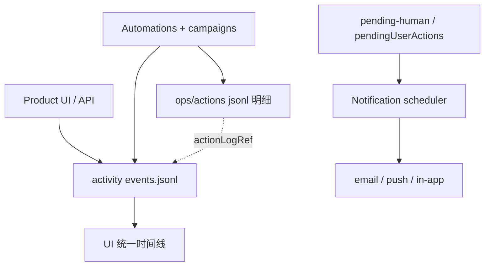

# 用户与 Automation 活动日志 + 催促通知

从 **用户注册** 起，**用户** 与 **Automation** 在本项目上的一切可见动作均写入 **统一活动日志**；  
用户可在时间线中看到：分析了市场、制定了计划、生成了代码、创建了 Facebook 账户、执行了发帖、采集了指标等。  

 whenever 需要用户提供信息，系统 **定期发送通知** 催促，直到用户完成或 Snooze。

> 全用户 · 全项目：用户级 + 项目级 `events.jsonl`；**一条时间线 = 用户行为 + Automation 全部工作**。  
> 营销动作明细另存 `ops/actions/*.jsonl`（可引用 `actionLogRef`）；见 §2.5。

---

## 1. 目标

| 目标 | 说明 |
|------|------|
| **完整审计** | 用户每一步 + **Automation 全部工作**（分析、定计划、写代码、跑营销、建号） |
| **可支持** | 客服/运营按 userId / projectId 回放时间线 |
| **可催促** | 任何「等用户」状态自动进入提醒队列，按策略重复通知 |
| **可配置** | 用户选渠道（邮件/Push/Telegram）；项目可覆盖 quiet hours |
| **不骚扰** | quiet hours、max 次数、Snooze；用户完成即停止 |

---

## 2. 活动日志架构



### 2.1 两级存储

| 层级 | 路径 | 记录什么 |
|------|------|----------|
| **User** | `tenants/{userId}/activity/events.jsonl` | 注册、登录、登出、改资料、建/归档 Project、账单变更 |
| **Project** | `tenants/{userId}/projects/{projectId}/ops/activity/events.jsonl` | **用户** Intake/确认/补信息 + **Automation** 分析/策略/代码/执行/营销/复盘 |

事件类型目录：`runtime/user-activity-events-catalog.json`（含 `categories`：analysis / strategy / code / execution / marketing / review）。

### 2.2 单条事件格式（JSONL）

```json
{
  "id": "evt_01HXXX",
  "ts": "2026-06-14T10:00:00.000Z",
  "type": "marketing.action.executed",
  "category": "automation.marketing",
  "level": "project",
  "userId": "usr_abc",
  "projectId": "prj_xyz",
  "actor": "automation",
  "actorId": "execution-runner",
  "source": "campaign",
  "summary": "Created Facebook Page and registered in accounts registry",
  "payload": {
    "actionId": "account.create",
    "channel": "facebook",
    "accountId": "fb_001",
    "taskId": "week1-social-setup",
    "actionLogRef": "ops/actions/2026-06-14.jsonl#line:42"
  },
  "correlationId": "run_phase_week_1"
}
```

| 字段 | 说明 |
|------|------|
| `type` | catalog 中 canonical 类型 |
| `category` | UI 筛选：analysis / strategy / code / marketing 等 |
| `summary` | **用户可读** 一句描述（时间线主文案） |
| `actor` | `user` \| `automation` \| `system` |
| `actorId` | userId 或 automation 名（`intake-analysis`, `strategy-planner`, `execution-runner`, taskId） |
| `source` | `web` \| `api` \| `automation` \| `campaign` \| `scheduler` |
| `correlationId` | 关联一次 Analysis / run-phase / Automation run |
| `payload` | 结构化摘要；**禁止** 密钥、session、PII 明文 |

### 2.3 必须记录：用户行为

| 阶段 | 事件 type（示例） |
|------|-------------------|
| 账号 | `user.registered`, `user.logged_in`, `user.profile_updated` |
| Project | `project.created`, `project.opened`, `project.archived` |
| Intake | `intake.form_saved`, `intake.material_uploaded`, `intake.analysis_requested` |
| 确认与响应 | `intake.feasibility_confirmed`, `credential.provided`, `user_input.provided`, `verification.completed`, `approval.granted` |
| 浏览 | `strategy.viewed`, `progress.viewed` |

### 2.4 必须记录：Automation 为项目做的一切

| 阶段 | 事件 type（示例） | 时间线文案示例 |
|------|-------------------|----------------|
| **分析市场** | `analysis.started`, `analysis.material_processed`, `analysis.site_scan_completed`, `analysis.existing_marketing_merged`, `analysis.market_feasibility_scored`, `analysis.completed` | 「扫描了官网 SEO/GA」「完成可行性分析」 |
| **制定计划** | `strategy.plan_created`, `strategy.phases_defined`, `strategy.registry_updated`, `strategy.progress_initialized` | 「生成 90 天计划与 3 个阶段」 |
| **创建代码** | `code.campaign_created`, `code.campaign_updated`, `code.artifact_generated` | 「生成 waitlist 页与 OG 图」 |
| **执行编排** | `execution.phase_started`, `execution.task_*`, `execution.phase_completed` | 「开始阶段 1」「完成任务 metrics-daily」 |
| **市场营销** | `marketing.action.executed`, `account.created`, `content.posted`, `metrics.collected` | 「创建 Facebook 主页」「发布 1 条帖子」 |
| **等待用户** | `user_input.requested`, `credential.requested`, `verification.required` | 「需要 Waitlist 表单 URL」 |
| **复盘** | `review.started`, `review.report_written`, `review.plan_adjusted`, `review.completed` | 「完成周复盘并调整计划」 |
| **Automation 运行** | `automation.run_started`, `automation.run_completed`, `automation.run_failed` | 「Strategy Planner 运行完成」 |

**规则：**

1. UI/API — 用户操作 append（`actor: user`）。  
2. 各 Automation run — 以 `automation.run_*` 包裹；内部分步 append。  
3. 每个 `campaigns/*/run.mjs` — `execution.task_*` + 营销类 `marketing.action.executed` / `account.created` / `content.posted`。  
4. **每条必须有 `summary`** — 用户时间线直接可读。  

实现：`runtime/campaign-lib/helpers.mjs` → `logActivity()`；`logAction()` 双写 activity。

### 2.5 与 `ops/actions/` 的关系

| 存储 | 粒度 | 受众 |
|------|------|------|
| `ops/activity/events.jsonl` | 时间线 — 用户 + Automation 全部里程碑 | 用户仪表盘 |
| `ops/actions/YYYY-MM-DD.jsonl` | 动作明细 — 每次发帖/DM/加好友 | 合规、调试 |

`marketing.action.executed.payload.actionLogRef` 指向 actions 行；UI 可展开详情。

### 2.6 保留与隐私

- 保留期：默认 **24 个月**（Enterprise 可合同延长）  
- 用户可请求导出/删除（合规 delete 级联 project activity）  
- `ipHash` 可选；不存完整 IP 于 git 工作区  

---

## 3. 「需要用户提供信息」的定义

以下任一即为 **Open user obligation**（开启催促）：

| 来源 | 条件 |
|------|------|
| Intake | 必填字段缺失 / validate 未通过 |
| Feasibility | `analysisCompletedAt` 有值且 `userConfirmedAnalysis !== true` |
| `ops/progress.json` | `pendingUserActions.length > 0` |
| `ops/pending-human.json` | 存在 `status: open` 项 |
| Vault | `credentialsRequested` 中有未 satisfied 且阻塞当前 phase |
| 批准门 | 高风险 action 待 `approval.granted` |
| 验证 | `verification_required` |

合并视图（UI）：**待办收件箱** = 上述去重后的卡片列表，每项带 `obligationId`。

---

## 4. 催促通知系统

### 4.1 配置

| 文件 | 作用 |
|------|------|
| `tenants/{userId}/notifications.json` | 用户默认渠道、语言、quiet hours |
| `tenants/.../projects/{id}/runtime/notifications.json` | 项目覆盖（可选） |
| 模板 | [runtime/notifications.template.json](../../runtime/notifications.template.json) |

### 4.2 默认提醒节奏

对 **每个 open obligation**（独立计时）：

| 次序 | 触发时间 | 渠道 |
|------|----------|------|
| 1 | 创建后 **立即** | In-app 待办 + Email |
| 2 | **+24h** 仍未完成 | Email |
| 3 | **+48h** | Email + Web Push（若启用） |
| 4 | **+72h** | Email（标题升级「Action needed」） |
| 5+ | 之后每 **7 天** | Email，直至完成或达 `maxRemindersPerItem`（默认 12） |

**Quiet hours（UTC 默认可配）：** 22:00–08:00 不发 Push/SMS；Email 可排队到窗口外发送。

**Snooze：** 用户可选 24h / 72h / 7d；写入 `notification.snoozed` 事件，暂停该 obligation 的 schedule。

**完成即停：** 用户提交信息 → obligation `resolved` → 取消后续 reminder；写 `user_input.provided` 等事件。

### 4.3 pending-human 扩展字段

`ops/pending-human.json` 每项增加：

```json
{
  "id": "ph_001",
  "type": "verification_required",
  "status": "open",
  "title": "Complete Facebook SMS verification",
  "createdAt": "2026-06-14T10:00:00Z",
  "notification": {
    "remindCount": 2,
    "lastRemindedAt": "2026-06-15T10:00:00Z",
    "nextRemindAt": "2026-06-16T10:00:00Z",
    "snoozedUntil": null
  }
}
```

`progress.pendingUserActions[]` 同步可选 `notification` 子对象（或平台 DB 统一 obligation 表）。

### 4.4 通知投递日志

`tenants/{userId}/notifications/delivery.jsonl` 或每 project `ops/activity/notifications.jsonl`：

```json
{
  "ts": "2026-06-15T10:00:00Z",
  "obligationId": "ph_001",
  "channel": "email",
  "templateId": "pending_human_reminder_24h",
  "status": "sent",
  "projectId": "prj_xyz"
}
```

同时 append `notification.sent` 到 activity log。

### 4.5 通知内容要求

每条催促须包含：

1. **要做什么**（一步说明）  
2. **为什么**（阻塞哪个 phase / task）  
3. **深链**（UI 直达待办页，带 `obligationId`）  
4. **Project 名称**（多 Project 用户）  
5. **可选 Snooze**

---

## 5. Platform 组件（v0.2+）

| 组件 | 职责 |
|------|------|
| **Activity API** | `POST /activity/events`（内部）；UI 批量 flush |
| **Activity timeline UI** | 用户只看自己的；支持按 project 过滤 |
| **Obligation scanner** | Cron：读 intake/progress/pending-human/credentials → 更新 open 集合 |
| **Notification scheduler** | Cron：读 open + `nextRemindAt` → 发信 → 写 delivery log |
| **Email provider** | SendGrid / SES / Resend |
| **Push** | Web Push VAPID |

Automation **不** 直接发邮件；写 pending 状态后由 **platform scheduler** 统一催促（避免重复 spam）。

---

## 6. 与用户旅程的衔接

```
注册 → log user.registered
  → 创建 Project → project.created
  → Intake 每一步 → intake.*
  → 分析完成 → 若未确认 → 24h 起催促 feasibility
  → 执行 blocked → pending-human → 立即 + 周期催促
  → 用户补全 → obligation resolved → 停止催促 → Automation 续跑
```

见 [user-journey.md](./user-journey.md) §7。

---

## 7. 验收标准

见 [features.md](./features.md) § F12。

---

## 8. 相关文档

- [multi-tenant-model.md](./multi-tenant-model.md) — 目录结构  
- [execution-and-actions.md](./execution-and-actions.md) §6 — 验证场景  
- [automation-commander.md](./automation-commander.md) — pendingUserActions  
- [PRD.md](./PRD.md) §5.12
