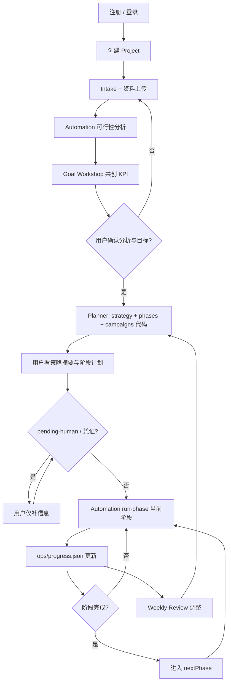

# 用户旅程

描述 **每一位客户、每一个 Project** 从注册到持续运营的完整路径（流程统一，数据隔离）。  
客户通过 **产品界面** 使用服务，**不** clone 仓库、**不** 手工执行营销 todo。

> 数据模型：[multi-tenant-model.md](./multi-tenant-model.md)  
> 总指挥契约：[automation-commander.md](./automation-commander.md)

---

## 1. 旅程总览（全用户 · 全项目）



**多项目：** User 下 Project A、B、C **各走上图全流程**；仅 intake/phases/campaigns 内容不同，**流程不变**。

---

## 2. 用户 vs Automation（每个 Project 相同）

| | 用户 | Automation 总指挥 |
|--|------|-------------------|
| Intake | 填表单、上传资料 | 分析 → feasibility → **Goal Workshop** → 等双确认 |
| 策略 | 读摘要、点确认 | 写 active-plan、**phases.json**、registry、**生成 campaigns 代码** |
| 执行 | **看** progress 仪表盘 | **run-phase**、写 actions/metrics/daily |
| 阻塞 | 仅响应 pending-human（凭证、验证、可选批准） | 暂停 phase，不替用户手工做 landing/发帖 |
| 复盘 | 读周报 | Weekly Review 调整 **本项目** 下一阶段 |
| 催促 | 收邮件/Push/站内待办；可 Snooze | 检测 open obligation → 0/24/48/72h + 每周提醒 |

---

## 3. 阶段详解

### 阶段 0 — 进入产品

- 注册 → 项目列表 → **`user.registered` / `user.logged_in` 写入 activity**  
- **无** git/npm

### 阶段 1 — 创建 Project（Provisioning）

平台为 **该 projectId** 创建独立工作区并复制模板：

- `intake/`、`strategy/`、`runtime/orchestrator/`（含 **phases.template** 结构）
- `campaigns/`、`ops/progress.json`（空任务列表）
- 见 [multi-tenant-model.md](./multi-tenant-model.md) §3

**User B 新建 Project 时重复相同 Provisioning，与 User A 无关。**

### 阶段 2 — Intake + 资料 + **现有营销**

用户：**仅** 输入信息、上传文件、**说明已在做的 SEO/GA/Facebook/广告等**（链接与 ID 有则填）。  
Automation：分析资料 + **扫描官网** 发现 GA/Pixel/SEO/社交 → 合并 `existing-marketing.json` → feasibility 基线章节。

### 阶段 2b — 可行性反馈

Automation 写 **本项目** `feasibility.md`；用户在 UI 阅读 Continue/Fix/Add 建议。  
**未确认前** 不进入 Goal Workshop。

### 阶段 2c — Goal Workshop（目标共创）

与用户 **一起** 确定：主 KPI（注册/访问/ waitlist/收入…）、目标数字、截止日期、**如何测量**（GA4 事件 / 产品 DB / Metrics API）。  
写入 `goals.userConfirmedGoals`。详述 [goal-workshop.md](./goal-workshop.md)。

**未确认目标前** 不生成 phases/campaigns。

### 阶段 2d — 双门禁后进入 Planner

需同时：`materials.userConfirmedAnalysis` + `goals.userConfirmedGoals`。

### 阶段 3 — Planner：策略 + 阶段链 + 代码

用户：确认策略（一次点击）。  
Automation **为本项目**：

1. `strategy/active-plan.md`  
2. `runtime/orchestrator/phases.json` — **阶段划分因项目而异**  
3. `registry.json` + `campaigns/{slug}/run.mjs`  
4. 初始化 `ops/progress.json`  

UI 展示：**Automation 将分哪些阶段、每阶段自动产出什么**，不是「请你本周完成以下 4 件事」。

### 阶段 3b — Identity Gate（greenfield 或 Growth 缺身份时）

Phase 1 foundation **artifact 可快速跑完**；进入 **Growth（发帖、邮件、新社媒）** 前，通过 **Identity Gate**：

- `infra.domain_dns` / `infra.email_setup` — 品牌邮箱（非批量 Gmail）
- `infra.measurement_connect` — GA4/GSC OAuth
- 已有社媒 → `account.login`；新号 → **已批准** `account.create` + `verification_required`

详见 [greenfield-identity-gate.md](./greenfield-identity-gate.md)。用户仅在 pending-human（DNS、OAuth、短信验证）时介入。

### 阶段 4 — 执行：Phase Loop（核心）

用户：**默认只查看** `ops/progress.json`。

Automation（Cron / Execution Runner）：

```bash
PROJECT_ROOT=tenants/{userId}/projects/{projectId} npm run marketing:phase
```

- 跑当前 `currentPhase` 全部 enabled tasks  
- 生成 landing、OG、内容草稿、metrics 等 **artifact**  
- 写入 `tasks[].summary`（已完成事项的描述）  

**仅当** `pendingUserActions` 非空时，用户才被要求输入（如 `WAITLIST_FORM_URL`、社媒 token、CAPTCHA）。

### 阶段 5 — 人工验证（按需）

与 [execution-and-actions.md](./execution-and-actions.md) 一致；用户完成验证后 Automation **自动续跑** phase，无需用户重新「启动 Week X」。

### 阶段 6 — 汇报与复盘

用户读仪表盘 / 周报。  
Automation 调整 **本项目** `phases.json` / strategy，进入后续阶段。

---

## 4. 多项目示例

| 用户 | 项目 | currentPhase | 用户操作 |
|------|------|--------------|----------|
| Alice | SaaS 出海 | phase_02_content | 只看 progress；补 SMTP |
| Alice | 国内电商 | phase_01_foundation | 只看 progress；补 waitlist URL |
| Bob | 唯一项目 | phase_01_foundation | 同 Alice |

Alice 切换项目 = 切换 **progress 视图**；**never** 在项目 A 看到 B 的 campaigns。

---

## 5. 路径映射（每个 Project 各一份）

| 概念 | 路径 |
|------|------|
| 进度（用户看） | `ops/progress.json` |
| 阶段定义 | `runtime/orchestrator/phases.json` |
| 用户可选输入 | `runtime/user-inputs.json` |
| 待办（用户做） | `ops/pending-human.json` + `progress.pendingUserActions` |
| **用户活动日志** | `ops/activity/events.jsonl` |
| **账号活动日志** | `tenants/{userId}/activity/events.jsonl` |
| 通知配置 | `runtime/notifications.json` + `tenants/{userId}/notifications.json` |
| 脚本 | `campaigns/` |
| 动作日志（Automation） | `ops/actions/` |

---

## 6. 非客户路径

平台开发者 clone 工程仓库维护 API/UI — 见 [deployment-guide.md](../deployment-guide.md)。  
Dogfood 示例：`projects/marketing-autopilot-launch/` 与 `tenants/.../projects/.../` **同构**。

---

## 7. 活动日志与催促（全旅程）

从 **注册** 起每一步写入 activity；**任何** 等用户输入的状态进入 **obligation 队列** 并 **定期通知**。

| 场景 | 日志 | 催促 |
|------|------|------|
| 注册 / 登录 | `user.registered`, `user.logged_in` | — |
| Intake 未填完 | `intake.form_saved` | 缺必填 → 24h 起提醒 |
| **Automation 分析** | `analysis.*`（扫站、可行性、existing-marketing） | — |
| 分析完未确认 | `analysis.completed` | `feasibility_unconfirmed` → 24h 起 |
| **Automation 定计划** | `strategy.plan_created`, `strategy.phases_defined` | — |
| **Automation 写代码/执行** | `code.*`, `execution.*`, `marketing.action.executed`, `account.created` | — |
| 缺凭证 / user input | `user_input.requested` | 立即 + 周期 |
| 人工验证 | `verification.required` | 立即 + 周期（高优先级） |

详述：[user-activity-and-notifications.md](./user-activity-and-notifications.md)
